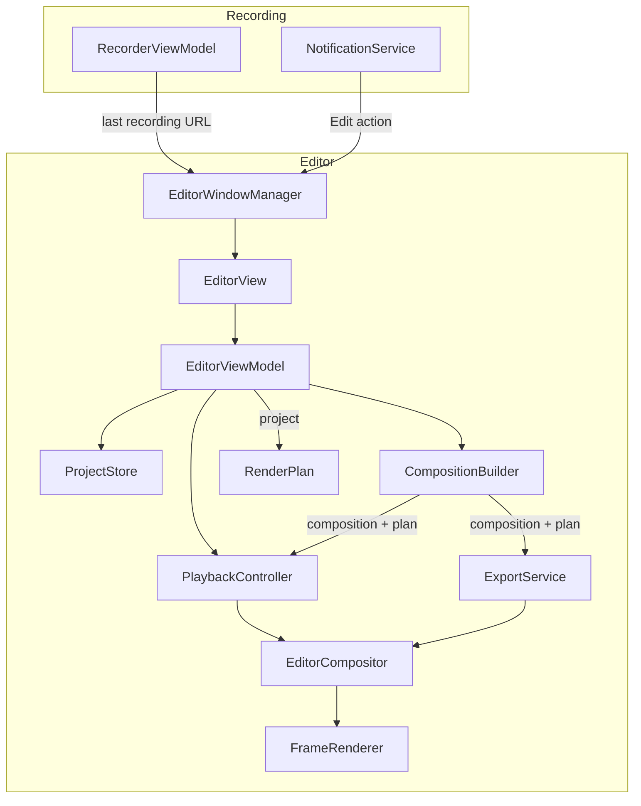

# Editor

> A non-destructive editor that turns a recording and its input telemetry into a polished video: trims and cuts, click highlights, keystroke overlays, auto-zoom, a rendered cursor and a styled canvas.

## Why

Recordings can now carry a `.telemetry.json` sidecar (cursor, clicks, scrolls, keys and capture geometry, timed on the video timeline). Nothing uses it yet. Editing features that need to know *where the user was working* - zooming in on clicks, smoothing the cursor, showing shortcuts - are exactly what the sidecar was designed for, and they are what separates a raw screen recording from one worth sharing.

## Expected outcome

- After a recording, "Edit" in the saved notification, or "Edit Last Recording" in the menu bar, opens an editor window for it.
- The editor plays the recording with every effect applied live, and scrubbing is frame accurate.
- Edits never touch the source video or its telemetry; they are saved as a project file next to the recording and can be undone.
- Export writes a new file that is pixel-identical to the preview, because both use the same renderer.
- Recordings without telemetry still open: trimming, cutting, canvas styling and export work, and telemetry-driven features are disabled with an explanation.

## Non-goals

Multi-clip or multi-track timelines, transitions, text and shape annotations, captions, speed ramps, audio editing beyond volume and cuts, GIF export. Each can come later without changing the architecture below.

---

## Architecture

### Components




| Component             | Role                                                                                                                                            |
| --------------------- | ----------------------------------------------------------------------------------------------------------------------------------------------- |
| `EditorWindowManager` | Opens one AppKit window per recording (hosting SwiftUI), switches the app's activation policy, holds the security scope while a window is open. |
| `EditorViewModel`     | `@MainActor @Observable`. Owns the `EditorProject`, selection and undo; rebuilds the render plan when the project changes.                      |
| `PlaybackController`  | `@MainActor @Observable`. Wraps `AVPlayer`: play/pause, coalesced frame-accurate seeking, current time.                                         |
| `ProjectStore`        | Reads and writes the project file atomically; debounced autosave.                                                                               |
| `CompositionBuilder`  | Builds the `AVMutableComposition` (kept ranges), `AVVideoComposition` and `AVAudioMix` from the project.                                        |
| `RenderPlan`          | Immutable, `Sendable` snapshot of everything needed to draw any frame, precomputed off the main actor.                                          |
| `EditorCompositor`    | `AVVideoCompositing` implementation. Stateless: it draws whichever frame AVFoundation asks for with the plan from its instruction.              |
| `FrameRenderer`       | Pure function `(source frame, time, plan) -> CIImage`. The single place where pixels are decided.                                               |
| `ExportService`       | Runs `AVAssetExportSession` with the same composition, with progress and cancellation.                                                          |


### Decisions

1. **One render path.** Preview (`AVPlayerItem.videoComposition`) and export (`AVAssetExportSession.videoComposition`) use the same custom compositor and `FrameRenderer`. What you see is what you export - by construction, not by testing.
2. **Everything is precomputed; frames are stateless.** AVFoundation requests frames out of order (scrubbing) and in parallel (export). Springs, smoothing and auto-zoom are therefore integrated once, when the plan is built, into sampled tracks. Drawing a frame is lookups plus a small Core Image graph - no simulation state, no locks, no allocation of large buffers.
3. **Effects live in source time.** Every time in the project (zoom segments, cuts) is seconds on the *original* video, which is also the telemetry's timeline. Only `TimeMap` knows about cuts; it maps output time to source time. Adding or moving a cut never invalidates an effect.
4. **Non-destructive and sidecar-based.** The project is `<name>.edit.json` next to `<name>.mov` and `<name>.telemetry.json`. Deleting it resets the edit.
5. **AppKit window, SwiftUI content.** The app is `LSUIElement` and its entry points (notifications, URL scheme, global shortcuts) have no SwiftUI view environment - the same reason `AppDelegate` owns `RecorderViewModel`. An `NSWindow` hosting an `NSHostingController` can be opened from anywhere. While any editor window is open the activation policy is `.regular` (Dock icon, ⌘-Tab, main menu); it returns to `.accessory` when the last one closes.
6. **No third-party dependencies.** AVFoundation, Core Image (Metal-backed), SwiftUI, AppKit.
7. **The cursor is redrawn, not baked in.** See [Cursor](#cursor).

### Time and coordinate spaces


| Space       | Unit / origin                  | Used by                                    |
| ----------- | ------------------------------ | ------------------------------------------ |
| Output time | seconds after cuts             | player, export, compositor requests        |
| Source time | seconds on the original video  | project, telemetry, render plan            |
| Screen      | global points, top-left origin | raw telemetry                              |
| Video       | pixels, top-left origin        | `InputTelemetry.videoPixel(for:geometry:)` |
| Core Image  | pixels, **bottom-left** origin | `FrameRenderer`                            |
| Output      | pixels of the export canvas    | canvas layout (Phase 6)                    |


Telemetry locations are converted to video pixels **once**, when the plan is built (one geometry lookup per event), then flipped into Core Image space by a single tested function. Nothing converts coordinates per frame.

### Cursor

When telemetry is on, the system cursor is hidden from the capture and the editor draws its own from telemetry. That is what makes smoothing, resizing, idle hiding and a sharp cursor at 2× zoom possible. Every editor-style recorder we surveyed does the same; only recorders without an editor bake the cursor in:


| App                   | Cursor in the video | How it knows the cursor's shape                                                                                             | Option to keep the real cursor        |
| --------------------- | ------------------- | --------------------------------------------------------------------------------------------------------------------------- | ------------------------------------- |
| Screen Studio         | never               | captured cursor images, some swapped for its own sharper versions                                                           | no                                    |
| Cap (Studio mode)     | hidden by default   | `NSCursor.currentSystemCursor` saved as PNG; known shapes matched against a built-in hash table and drawn as vector cursors | yes, but auto-zoom is then turned off |
| OpenScreen            | hidden by default   | `NSCursor.currentSystem` PNGs, plus an Accessibility guess (text field → I-beam, link → hand)                               | yes, but auto-zoom is then turned off |
| Screenize, Retake     | hidden              | none; always an arrow                                                                                                       | no                                    |
| Kap, Cap Instant mode | baked in            | none                                                                                                                        | not applicable                        |


**Recording**

- `recordInputTelemetry` hides the cursor by default. A "Keep system cursor in video" setting bakes it in instead.
- Telemetry is still recorded when the cursor is baked in. Unlike Cap and OpenScreen, auto-zoom, click highlights and keystrokes keep working; only the cursor effects are unavailable.
- `capture.cursorInVideo` records which of the two applies, so the editor never draws a second cursor.

**Shape capture**

- Read `NSCursor.currentSystem` on a timer at up to 15 Hz, whether or not the mouse moves. Screen Studio shipped a fix for a pointer shape that stuck after clicking a link without moving the mouse, which is what happens when shape is sampled only on movement; a timer catches that change within about 67 ms.
- Identify the shape by comparing its fingerprint (size, hot spot and the pixels of its smallest bitmap) with those of `NSCursor`'s standard cursors on the running OS (arrow, I-beam, pointing hand, open and closed hand, crosshair, not-allowed, zoom, column, row and frame resize, and so on), built on first use. Measured: another app's arrow is byte-identical to `NSCursor.arrow`, so an exact match is enough. Unlike Cap's hard-coded hash table, this doesn't break with each OS release; Cap had to add hashes for new cursors, and some hand cursors went unrecognised.
- Every shape is stored once as a PNG of its largest bitmap, with its hot spot and size in points, plus its `kind` when it matched. Custom app cursors (e.g. Figma's) and cursors enlarged in Accessibility settings have no kind.
- Shape is a step track: an entry is written only when the shape changes. Raw data is kept raw; flicker is cleaned up in the editor.

**Rendering**

- Every shape is drawn from its captured PNG at its hot spot. The arrow and I-beam are captured at up to 10× (280×400 px for the arrow), so they stay sharp when zoomed; the other standard cursors only exist up to 2×, on the editing Mac too, so `NSCursor`'s own images would be no sharper. No bundled cursor art or licensing to manage.
- `kind` is for treating shapes by meaning, e.g. restyling arrows or reading an I-beam as typing. With no shape data at all, the cursor is an arrow.
- Shape changes that last only a moment are dropped, the way Screen Studio's "Optimize original cursor types" option does.

**When** `NSCursor.currentSystem` **goes away.** The macOS 26 SDK marks it to be deprecated ("will always be nil in a future version of macOS"), and Apple's docs list it as deprecated from macOS 27. There is no public replacement; the only cheap change detection is the private `CGSCurrentCursorSeed`, which we don't use. When it returns nil, shape capture records nothing and the editor draws an arrow at the recorded positions, so the feature degrades rather than breaks. Guessing the shape from Accessibility roles, as OpenScreen does, is a possible later fallback, but it needs the Accessibility permission, so it is left out for now.

### Data flow of an edit

1. A view calls an intent on `EditorViewModel`, e.g. `moveZoom(id:to:)`.
2. The view model mutates `project` through one `edit(_:_:)` function that registers undo with the previous value. Continuous gestures register one undo step when the gesture ends.
3. `project` changing triggers a debounced autosave and a plan rebuild. The rebuild runs off the main actor and cancels the previous one.
4. The new plan goes into a new `EditorInstruction`, and a new video composition is assigned to the player item. AVPlayer re-renders the current frame; if paused, it re-seeks to the current time to force a redraw.

```swift
/// The edit applied to one recording. Saved as `<name>.edit.json` next to it.
///
/// All times are seconds on the source video's timeline, the same one the telemetry uses.
nonisolated struct EditorProject: Codable, Equatable, Sendable {
    var version = 1

    /// Source ranges left out of the output, sorted and non-overlapping. Trimming is a cut at either end.
    var cuts: [Range<Double>] = []
    var splits: [Double] = []
    var zooms: [ZoomSegment] = []
    var clickHighlights = ClickHighlightStyle()
    var keystrokes = KeystrokeOverlayStyle()
    var cursor = CursorStyle()
    var canvas = CanvasStyle()
    var audio = AudioMixSettings()
}
```

```swift
/// Everything needed to draw any frame, precomputed when the project changes.
///
/// Immutable and shared by every compositor request, so frames can be rendered in any
/// order and in parallel.
nonisolated struct RenderPlan: Sendable {
    let timeMap: TimeMap
    let videoSize: CGSize
    let camera: CameraPath           // sampled viewport track, O(1) lookup
    let cursor: CursorPath?          // nil when the cursor is baked into the video
    let cursorShapes: CursorShapeTrack  // which image it shows, decoded once
    let clicks: [ClickMarker]        // in Core Image pixel space, sorted by time
    let keystrokes: [KeystrokeChip]  // labels pre-rendered into images
    let canvas: CanvasLayout         // output size, the video's frame, the backdrop drawn once
    let dynamicRange: DynamicRange   // SDR, PQ or HLG
}

extension RenderPlan {
    /// Builds the plan off the main actor; the project's default isolation is `MainActor`.
    @concurrent
    static func build(project: EditorProject, source: EditorSource, resources: RenderResources, target: RenderTarget) async -> RenderPlan { ... }
}
```

```swift
/// Carries the render plan to the compositor. A new instruction is created for every plan.
nonisolated final class EditorInstruction: NSObject, AVVideoCompositionInstructionProtocol, @unchecked Sendable {
    let timeRange: CMTimeRange
    let requiredSourceTrackIDs: [NSValue]?
    let passthroughTrackID = kCMPersistentTrackID_Invalid
    let enablePostProcessing = false

    /// Frames differ even when the source does not, e.g. during a zoom.
    let containsTweening = true

    let sourceTrackID: CMPersistentTrackID
    let plan: RenderPlan
    ...
}
```

---

## Engineering standards

These apply to every phase, on top of `AGENTS.md`.

**Structure**

- New code goes in a feature folder, `Reco/Editor/{Model,Render,Service,ViewModel,View}`. The Xcode project uses synchronized folders, so no project file edits are needed.
- One type per file. Files stay under 500 lines and types under 300 (the SwiftLint limits).
- Models and algorithms are `nonisolated` value types that are `Sendable` and pure (auto-zoom, camera path, cursor smoothing, time mapping, key labels). They are unit tested without AVFoundation. Side effects stay at the edges, in the services.
- The target builds in Swift 6 language mode with complete concurrency checking. Use `@concurrent` for work that must leave the main actor, and never GCD.

**Performance**

- The frame path allocates nothing proportional to the recording's length. Lookups into sorted tracks are binary searches (a small `partitioningIndex` helper); sampled tracks (camera, cursor) are O(1) index plus lerp.
- One Metal-backed `CIContext` is shared by all compositor instances (it is thread-safe), created with `cacheIntermediates: false`, as recommended for video, and with color management off, so frames stay in the source's encoding (measured in Phase 2: half the render time at 4K). HDR frames too: their plan draws the overlays in the recording's encoding (Phase 6).
- Source frames are requested in the decoder's native format (`420v`/`420f` for H.264/HEVC) so Core Image reads YUV directly without an extra conversion.
- Static images (cursor sprites, keycap labels, backgrounds) are created once per plan, never per frame.
- Main actor: high-frequency playback time is kept out of the view model's observed state. Only the playhead view reads it, through `TimelineView(.animation)` while playing, so a tick redraws the playhead and nothing else.
- Timeline markers (thousands of clicks and keys) are drawn in one `Canvas`, not as individual views.
- Seeks are coalesced: at most one seek is in flight, and the latest requested time replaces any pending one (the technique from Apple's QA1820). `seekingWaitsForVideoCompositionRendering = true` keeps scrubbing honest.
- Thumbnails come from `AVAssetImageGenerator.images(for:)`, with `maximumSize` set to the on-screen size, cached, and cancelled when the timeline's scale changes.
- Telemetry and project decoding run off the main actor. An hour of cursor samples is a JSON file of about 10 MB.
- Plan builds, frame renders and exports are measured with `OSSignposter` intervals. **Budget:** a 4K source frame renders in under 8 ms at p95 on Apple Silicon, and a plan for a 10-minute recording builds in under 50 ms.

**Correctness**

- Times are `Double` seconds in the model and are converted to `CMTime` only at the AVFoundation boundary, using the source track's `naturalTimeScale`. Cut boundaries snap to frame boundaries. Doubles are never compared for equality; frame indices are.
- Errors are a typed `EditorError`. Failures are logged with a `Logger` category per type and surfaced in the window, never swallowed.
- Unsupported versions of telemetry and project files are reported, not guessed at.

**Tests** use Swift Testing (`import Testing`), as the existing suite does. Fixtures (small telemetry and project JSON files) live in `RecoTests/Fixtures`.

---

## Phases

Phases 0–4 are the first shippable editor. Each phase ends in a working, mergeable state.

| Phase | Status | Left to check in the app, on real recordings |
| ----- | ------ | -------------------------------------------- |
| 0 - Recording prerequisites | Done | Cursor kinds (arrow → I-beam → pointing hand) in a v3 recording made without the cursor |
| 1 - Editor shell and playback | Done | Scrubbing a 10-minute 4K recording; releases on close (Memory Graph) |
| 2 - Render pipeline, overlays, export v1 | Done | Highlight placement for each capture kind; redraw on a style change; render budget in Instruments |
| 3 - Trim and cut | Done | Trimming, splitting and cutting; no clicks at cuts |
| 4 - Zoom | Done | Where auto-zoom lands; transitions at full frame rate; moving and resizing zooms on the timeline |
| 5 - Cursor | Done | How the smoothing looks; shapes and idle hiding; the render budget on a quiet machine |
| 6 - Canvas and export polish | Done | How canvases look; a background picture after relaunch; HDR recordings, ProRes ones too; transparent exports; the Recordings window |

### Phase 0 - Recording prerequisites (S)

Recording-side changes that the editor depends on. They come first so that every recording made from now on carries the data.

1. **Land telemetry.** Done: on `main`. Its mapping is verified visually in Phase 2.
2. **Spike:** `NSCursor.currentSystem` **in the sandbox.** Done:
  - It returns other apps' cursors from a sandboxed build.
  - The standard `NSCursor` set identifies them by exact fingerprint (measured for the arrow; the other kinds are checked by "Done when" below). All 44 standard cursors have a fingerprint; the only identical images are opposite frame resize cursors, which share a kind.
  - A read costs about 0.3 ms. The PNG is encoded and the kind looked up only the first time a shape is seen.
3. **Cursor hidden by default.** Done. When `recordInputTelemetry` is on, the capture hides the cursor. A "Keep System Cursor in Video" setting, off by default, bakes it in; telemetry is recorded either way. "Show Cursor" is disabled while it has no effect.
4. **Telemetry v3** (see [Cursor](#cursor)). Done; the new fields are optional to read, so the version stays 3:
  - `capture.cursorInVideo: Bool`, so the editor never draws a second cursor. Files without it are read as `true`, because `showCursor` defaults to true.
  - `cursorSprites`: each unique shape once, as a PNG with hot spot and size in points, plus `kind` (a `CursorKind` covering the standard `NSCursor` set) when it is a standard cursor.
  - `cursorShapes`: a step track of `(time, sprite)`, sampled at up to 15 Hz, written only on change.
5. **Tests:** Done. Round trip, decoding files without the new fields, standard-cursor classification, deduplication of shapes, and a step track that stores only changes.

**Done when:** a v3 recording made without the cursor in the video has no cursor in its frames and records the right kinds (arrow → I-beam → pointing hand) as the pointer moves across apps, and files without the new fields still decode. Only the real recording is left to check.

### Phase 1 - Editor shell and playback (M)

**Build**

- `EditorWindowManager`: one window per recording (a second request focuses the existing one), activation policy switching, and the output folder's security scope held for the window's lifetime (`startAccessingOutputDirectory()`).
- Entry points: an "Edit" action on the recording-saved notification, "Edit Last Recording" in the menu bar (`RecorderViewModel` keeps `lastRecordingURL`), and a `reco://edit-last` URL. When the recording was made without the cursor in the video, "Edit" is the notification's default action, because the raw file has no cursor until it goes through the editor.
- `EditorSourceLoader`: loads the asset (duration, video track, natural size, frame rate, audio tracks), the telemetry (optional, off the main actor, version checked) and the project, or creates a default one.
- `PlaybackController`: play/pause, coalesced seeking, frame stepping (`AVPlayerItem.step(byCount:)`), and end-of-item handling.
- Preview: `AVPlayerLayer` in an `NSViewRepresentable`, with no system controls.
- Timeline: a filmstrip, the playhead, scrubbing, and telemetry lanes (click and key ticks) drawn in a `Canvas`.
- `EditorProject` v1, `ProjectStore` (atomic writes, autosave after edits settle, save on close) and undo through the window's `UndoManager`.
- Keyboard: space to play/pause, ←/→ to step a frame, ⌘Z/⇧⌘Z to undo/redo.

**Done when**

- The editor opens from the notification with a placeholder, and the recording is playable without blocking the UI while the asset loads.
- Scrubbing a 10-minute 4K recording is smooth and lands on exact frames.
- Closing the window releases the player, the thumbnails and the security scope (checked with the Memory Graph debugger), and restores the `.accessory` policy.
- Tests: project round trip and unknown-version rejection, telemetry v2/v3 fixture decoding, `TimeMap` identity when there are no cuts.

**Status:** Built and unit tested; the manual checks above (a real 10-minute 4K recording, the Memory Graph on close) are left. Where the build differs from the plan:

- `EditorProject` v1 holds only `cuts`, as `Range<Double>` like the recorder's pauses (no `SourceRange` type). Each later phase adds its fields, decoded with `decodeIfPresent` so v1 files stay readable without a version bump.
- `EditorSourceLoader` loads what playback needs; audio tracks are added with the composition in Phase 3. `seekingWaitsForVideoCompositionRendering` is set in Phase 2, when there is a video composition for it to wait on.
- `ProjectStore` only reads and writes; the view model debounces autosave (1 s) and saves on close. Nothing is written until the first edit.
- `AppDelegate` owns the `EditorWindowManager`, so `RecorderViewModel` only gains `lastRecordingURL`. The notification's Edit action carries the file's URL; `InputTelemetryRecorder.writeSidecar` reports whether the cursor was left out, which makes Edit the default action.
- Frame stepping uses `step(byCount:)` only when no seek is in flight; otherwise it seeks, so it never steps from a stale position. `FrameGrid` maps frames to times.
- Unsupported file versions throw `UnsupportedVersionError` from `InputTelemetry` (reads v2–v3) and `EditorProject` (reads v1). A telemetry problem opens the editor without telemetry and says why; a project problem refuses to open, so a newer project file is never overwritten.

### Phase 2 - Render pipeline, overlays, export v1 (L)

The core of the editor. After this phase, adding an effect means adding a precomputed track to `RenderPlan` and a step to `FrameRenderer`.

**Build**

- `CompositionBuilder`, `EditorInstruction`, `EditorCompositor`, `RenderPlan`, `FrameRenderer`, and plan swapping on edit.
- **Click highlights:** a ring or ripple at the mapped click location, animated by the time since the click. Style options: color, size, duration, left/right only.
- **Keystroke overlay:** `KeyLabelFormatter` maps a key code to a label using the current keyboard layout (`UCKeyTranslate`), plus a fixed table for special keys (⏎ ⌫ ⇥ ⎋ arrows) and modifier glyphs (⌃⌥⇧⌘). Chips are rendered once per unique label and fade after a hold time. **Privacy default: shortcuts only** (keys pressed with ⌘/⌃/⌥, and special keys). Showing all keys is opt-in with a warning, since telemetry includes anything typed, passwords too.
- An inspector (`.inspector`) with the style controls.
- `ExportService`: `AVAssetExportSession` with `export(to:as:)` and `states(updateInterval:)` for progress, a codec preset (HEVC, H.264, ProRes 422) and cancellation. It writes `<name>-edited.<ext>` to the output folder and reveals it in Finder.

**Done when**

- Click highlights land on the cursor tip in the source for display, window (including a window moved mid-recording, with and without shadow) and area recordings, on Retina and non-Retina displays. Any offset found here is fixed in `InputTelemetry.videoPixel(for:geometry:)` / `shadowTopFraction`, and the cases are added to `docs/SMOKE_TESTING.md`.
- Changing a style while paused redraws within one frame.
- Signposts show the render budget is met.
- An exported frame matches the previewed frame at the same time: a test renders a synthetic source through `FrameRenderer` and checks the highlight's pixel location.
- Tests: mapping to Core Image space, key label formatting (US layout fixture), chip timing.

**Status:** Built and tested, including an end-to-end export of a synthetic recording whose exported frame shows the highlight at the click. Still to check on real recordings: highlight placement for each capture kind (then `docs/SMOKE_TESTING.md`), redraw on a style change, and the render budget in Instruments. Where the build differs from the plan:

- `RenderPlan` holds what Phase 2 draws: `timeMap`, `videoSize`, `clicks` plus one ring image (`clickRing`, `clickDuration`), and `keystrokes` plus `chipImages`. Camera, cursor and canvas come with their phases. Images are drawn once per plan by `OverlayImages`.
- The video composition wraps the source asset; the `AVMutableComposition` with kept ranges and the audio mix come in Phase 3. The compositor already maps output to source time through the plan's `TimeMap`.
- Click size is in screen points, converted with each click's geometry, so a ring has the same size next to the cursor on any display. "Left/right only" is a `buttons` choice: all, left or right.
- One chip shows at a time: the latest press, held 1.5 s and fading over the last 0.3 s, or until the next press. Auto-repeats are skipped. The chip is 6% of the video's shorter side, centred at the bottom.
- `KeyLabelFormatter` reads the layout on the main actor when the editor opens (Text Input Sources aren't safe off it); tests use the installed US layout (`com.apple.keylayout.US`) rather than a fixture file.
- Inspector edits coalesce: the same control changed again within 1 s joins its undo step, which covers slider drags and the color panel alike.
- HEVC and H.264 export to MP4, ProRes 422 to MOV. An earlier export with the same name is replaced; a cancelled or failed one leaves no file.
- Measured on an M1 (Debug build, synthetic 4K source with a ring and a chip): a frame renders in about 5 ms p50 and 8 ms p95, right at the budget, with color management off; converting every pixel to linear light and back took 10 and 13 ms. A plan for a 10-minute recording with 3,000 clicks and 12,000 keys builds in about 24 ms.
- `AVAssetExportSession.export(to:as:)` is back-deployed below macOS 26, and its fallback body brought in a completion-handler thunk that collided with the one `AssetWriter`'s `await finishWriting()` used, crashing every stop. `AssetWriter` now finishes through an explicit continuation.
- New shared helpers: `InputTelemetry.geometry(at:)` (the geometry entry in effect at a time) and `RandomAccessCollection.partitioningIndex(where:)`, the binary search every sorted-track lookup uses.

### Phase 3 - Trim and cut (M)

**Build**

- `TimeMap`: piecewise output ↔ source mapping with binary search, with cuts normalized (sorted, merged, clamped, frame-snapped).
- `CompositionBuilder` inserts only the kept ranges, for the video and both audio tracks (system audio and microphone).
- Timeline: trim handles, split at the playhead (S), and delete of a selected range (⌫).
- Audio: per-track volume and mute through `AVAudioMix`, with 10-20 ms ramps at every cut so they don't click.

**Done when**

- Export duration equals the sum of the kept ranges, within one frame.
- Effects stay attached to their content across cuts; they need no remapping code.
- Tests: `TimeMap` round trips, boundaries, adjacent and overlapping cuts, cuts covering everything.

**Status:** Built and tested, including an export with a cut that has the kept length and shows the right frame after the cut, and a mix measured silent at the cut and at each track's volume. Still to check in the app on a real recording: trimming, splitting and cutting, and that cuts don't click. Where the build differs from the plan:

- The timeline always shows the whole recording in source time: cut parts are dimmed and the playhead skips them. The lanes, the filmstrip and Phase 4's zoom lane need no mapping, and a cut is restored by dragging its edge back. Every kept part has a handle on each edge; dragging one trims or restores up to the neighbouring kept part, and keeps at least one frame. A trim is one undo step, committed when the handle is let go.
- Splits are saved in the project (`splits`, source seconds), so a split is an undoable edit. A segment is a kept range divided at the splits inside it; clicking selects one, and ⌫ cuts it unless it's the last one left.
- `TimeMap` owns every cut operation (add, restore, move an edge, divide at splits). It normalizes in frame boundaries, the last being the recording's end wherever it falls, so a trailing cut never leaves a sliver.
- The composition keeps the source's track IDs, so the video composition and the mix name tracks directly. A new player item is made only when the cuts change, with the playhead kept on its content; other edits swap the video composition, and volume changes only the mix.
- Fades are 25 ms, not 10–20: the mix lags its volume ramps by about 10 ms. Measured at a cut, 10 ms ramps still left 57% of the volume, 20 ms 20%, and 25 ms 2%.
- Audio tracks are named by the recorder's order: with two, system audio then the microphone; a single track is "Audio", since it could be either.
- Recordings whose tracks end at slightly different times build and export (checked with audio 50 ms longer and 300 ms shorter than the video).

### Phase 4 - Zoom (L)

**Build**

- `ZoomSegment`: source range, scale, focus (`.followCursor` or `.fixed(point)`), and `isAutomatic`.
- `AutoZoomGenerator`, a pure function of the telemetry:
  1. Activity = click downs, plus key presses located at the last click.
  2. Consecutive events are grouped while the gap is under 2 s and the group's bounding box still fits inside the zoomed viewport.
  3. Segment = `[first − 0.5 s, last + 1.5 s]`, clamped, with a minimum length; close segments are merged.
  4. The focus is the group's centroid, clamped so the viewport never leaves the frame.

  The constants live in `AutoZoomGenerator.Configuration`. "Regenerate" replaces automatic segments only and keeps manual ones.
- `CameraPath`: targets over time (a segment's scale and focus, otherwise 1× centered). It is integrated with a critically damped spring at a fixed 120 Hz step, with scale interpolated in log space so zoom speed looks even. Follow-cursor moves only when the cursor leaves a central dead zone. The integrated samples are what gets stored.
- `FrameRenderer` applies the viewport transform to the content and to content-anchored overlays (clicks, cursor); keystroke chips stay in output space.
- Timeline: a zoom lane with segments you can drag, resize and delete, "add at playhead", and a per-segment scale control in the inspector.
- A hint when the recording was not made at native resolution: zooming 2× halves the effective resolution (`captureNativeResolution`).

**Done when**

- Tests: the generator is deterministic on fixtures, produces no overlapping segments and keeps segments within the duration; the camera path has no jumps between samples beyond a threshold, keeps the viewport inside the frame, and reaches 1× between segments.
- Zoom transitions play at full frame rate in preview.

**Status:** Built and tested, including the "Done when" tests above and a render of a zoomed frame whose click ring lands at the frame's centre at twice its size, while the keystroke chip keeps its size and place. Still to check in the app on real recordings: where auto-zoom lands, that transitions play at full frame rate, and moving and resizing zooms on the timeline. Where the build differs from the plan:

- Automatic zooms are made when a project is created (the recording has no `.edit.json` yet), and saved with the first edit. Editing an automatic zoom makes it manual, so "Regenerate" keeps it.
- Focus points are fractions of the video's width and height from its top-left corner, so they don't depend on its resolution.
- Presses outside the video, such as clicks beside a recorded window, are ignored, and so is typing after them. Keys pressed before any click are ignored too.
- Circling the cursor around something zooms on it, from when the circling starts. A circle is a stretch of the cursor's path, followed in steps of 1% of the video so drift doesn't turn it, that turns all the way round within one view without a pause or a turn sharper than 135° (shaking reverses by about 180°), and ends within half its size of where it started; the move into it is trimmed off. Each further turn is another circle, so continued circling keeps the zoom. Real circling measured 40–110 pt across, a turn every 0.3–0.5 s, with oval, pointed ends; on three real window recordings it found all 10 circled spots and nothing else. Without the closure rule, the curve leading into a circle joined it and moved its centre.
- Zooms closer than 1 s merge only when all their presses fit one view. Otherwise the first ends where the second starts (halfway between their presses when they'd overlap), so the camera pans across without zooming out.
- `CameraPath` uses the exact step of a critically damped spring at 10 rad/s, for each of centre x, centre y and log scale. A move is 96% done after 0.5 s, and each axis stops within 0.04 px at 4K, about 1.4 s after a 2× zoom starts or ends. Frames without zoom are then the source's pixels exactly. The follow-cursor dead zone is the middle half of the view.
- Clicks are drawn before the frame is magnified, so their rings zoom with the content; the keystroke chip is drawn after.
- Only the cursor samples inside zooms that follow the cursor are placed. Measured on an M1 in Debug, for a 10-minute recording with 455 zooms, half of them following the cursor: the plan builds in about 45 ms (36 ms camera, 9 ms cursor), and 0.1 ms without zooms. A zoomed 4K frame with a ring and a chip renders in 4.7 ms p50 and 8.1 ms p95, against 4.2 and 7.4 ms unzoomed.
- The timeline has one selection (`EditorSelection`): a segment or a zoom. ⌫ cuts the segment or deletes the zoom, and Z adds a zoom at the playhead: 3 s long, or up to the next zoom, and at least 0.5 s. A zoom added by hand follows the cursor when the telemetry has one to follow; otherwise it's fixed on the frame's centre.
- The inspector sets a fixed focus by dragging the view's outline on a picture of the frame (`ZoomFocusPad`), which uses the filmstrip's thumbnails.
- Telemetry doesn't record the Native Resolution setting, so the hint shows when the recording has fewer than 2 video pixels per screen point (`InputTelemetry.pixelsPerPoint`), whatever the reason.

### Phase 5 - Cursor (M)

Needs Phase 0 data and recordings made with the cursor hidden (`cursorInVideo == false`). Otherwise the inspector explains why cursor options are unavailable.

**Build**

- `CursorPath`: raw samples resampled to 120 Hz, then smoothed with a spring, using Cap's model as the starting point:
  - A default spring of tension 470, mass 3 and friction 70.
  - A stiffer spring within about 175 ms of a click.
  - A glide onto the click point starting about 500 ms before the click.
  - Jitter filtering (tiny direction reversals) before smoothing.

  **Constraint:** the smoothed path passes exactly through every click location at its click time, so the cursor and the click highlight never disagree. Presets (Mellow, Smooth, Fast) set the spring constants.
- `CursorShapeTrack`: the telemetry's shape changes, with shapes that last only briefly dropped (threshold in its configuration). For v2 files, or when capture recorded nothing, it is a single arrow.
- `CursorSprites`: one `CIImage` per shape, built once per plan from its captured PNG and aligned by hot spot.
- Effects: a size multiplier, a press animation on click (scale to 0.8× over about 130 ms), and hiding when idle (off by default; fades out after 2 s).

**Done when**

- Tests: smoothing lag is bounded, the path hits every click exactly, brief shape changes are dropped, v2 files fall back to an arrow, and idle detection works.
- The cursor is sharp at 2× zoom and its hot spot sits on click highlights at every zoom level.

**Status:** Built and tested, including the "Done when" tests above: at 2× the cursor is drawn pixel for pixel from its recorded image, and its hot spot lands on the click at 1× and 2×. Still to check in the app on real recordings: how the smoothing looks, the shapes, idle hiding, and the render budget on a quiet machine. Where the build differs from the plan:

- The springs are critically damped: the camera's, now a shared `Spring`. Cap's friction of 70 overshoots by 0.03%, which doesn't show. The presets are 7, 12.5 and 25 rad/s, trailing a steady move by 290, 160 and 80 ms; Smooth is Cap's default (tension 470, mass 3).
- Clicks are hit exactly without a stiffer spring. The offset from the smoothed path to each click point eases in over 0.5 s before the click and out over 175 ms after, never past the neighbouring clicks. It's added at lookup, so the path is exact between samples too. Releases count as clicks, so a drag ends where the button was let go.
- Jitter is a move back against the previous one by less than 2 pt.
- `CursorSprites` became part of `CursorShapeTrack`, which decodes each image once per plan and drops shapes shown for under 150 ms (shapes are sampled at 15 Hz).
- The cursor is drawn after zooming, scaled in one step from its recorded resolution with `highQualityDownsample`, so it's sharp when zoomed and doesn't alias at 1×.
- The fallback arrow is `NSCursor.arrow`'s largest image (`StandardCursors.arrowSprite`), read when the editor opens. It's for recordings whose system reported no cursor images, or images that can't be read. Version 2 files have the cursor in the video, so the editor draws none for them.
- The press animation holds 0.8× while the button is down. Idle hiding fades out over 0.3 s, and fades back in so the cursor is fully shown when it next moves or clicks.
- The camera and the cursor are built in parallel. Measured on an M1 in Debug, for 10 minutes with 455 zooms, 3,000 clicks, 12,000 keys and the cursor moving throughout at 60 Hz: the plan builds in about 42 ms instead of 105 (38 ms camera, 35 ms cursor).
- The cursor adds 1 to 1.4 ms to a 4K frame, like any overlay: Core Image composites it over the whole frame, so the image's size doesn't matter, and `highQualityDownsample` adds at most 0.2 ms. The machine was under load then (load average 3): a frame without the cursor took 7.5 ms p50 and 10.7 ms p95, against 4.2 and 7.4 in Phase 4, so the budget is to be re-checked in Instruments.

### Phase 6 - Canvas and export polish (L)

**Build**

- Canvas: aspect presets (source, 16:9, 9:16, 1:1, 4:3), padding, corner radius, shadow, and a background (color, gradient, or image through a user-selected file with a security-scoped bookmark).
- Export: resolution and frame rate options, and a reader/writer path reusing `AssetWriterSettings` if bitrate control is needed beyond presets.
- HDR: `supportsHDRSourceFrames`, BT.2020 PQ/HLG colorimetry on the composition, and 10-bit output buffers. Until this phase, HDR sources are converted to SDR by AVFoundation, the default when the compositor doesn't declare HDR support.
- Alpha: a transparent background exports as ProRes 4444.
- A recents list of the output folder's recordings, with thumbnails.

**Done when**

- Every export preset plays in QuickTime.
- HDR exports keep PQ/HLG metadata (checked on the track's format description).
- The smoke test matrix is extended.

**Status:** Built and tested, including exports that keep PQ in HEVC and ProRes 422 and turn it to SDR in H.264 (checked on the exported track's format description), a ProRes 4444 export whose padding reads back transparent, and an export at a chosen size and frame rate. Still to check in the app: how canvases look, a background picture after relaunch, HDR recordings (ProRes ones tag each frame, so whether their format description carries the transfer function is unconfirmed), transparent exports in an editing app, and the Recordings window; the smoke test matrix has these as tests 26 to 30. Where the build differs from the plan:

- New projects get a styled canvas: a gradient, 8% padding, corners 1.5% round and a shadow, each a share of the frame's shorter side. `CanvasStyle.plain` is the recording as it is.
- The canvas keeps the video's shorter side (9:16 from 4K is 2160×3840). Export sizes are shorter sides (2160, 1440, 1080, 720, those smaller than the canvas's) and frame rates 60, 30 or 24 below the recording's. An export is drawn at its size (its own plan, `RenderTarget`), not scaled afterwards, so at the original size it matches the preview pixel for pixel.
- No reader/writer path: the presets take the video composition's size and frame rate. Bitrate is still the presets' (see Risks).
- Zoom and canvas placement are one transform, so the video is resampled once, and the cursor is drawn at its final scale.
- Frames are drawn region by region into the output buffer (`FrameRenderer.draw`, `CanvasLayout.regions`): the padding from the backdrop alone, the video in 8 bands, and its rounded corners with the mask. Core Image evaluates every overlay across the whole region it renders; in bands it skips them where they aren't. Measured on an M1 in Debug, for a 4K frame with a ring and a chip under load (load average 4 to 6): 3 ms p50 plain, against 7 drawn whole, and 3.7 to 5 ms on the default canvas, against 9; p95 stays under 7.5 ms. This also halves Phase 2's plain render time.
- The backdrop (background and shadow) is drawn once per plan into an IOSurface-backed buffer that frames read in place: 4 ms at 4K, 17 ms the first time. The shadow is blurred at an eighth of the size. Of the backdrops measured per frame, a gradient generated per frame cost as much and a half-size bitmap more.
- A background picture is kept as a security-scoped bookmark in the project and read upright, in sRGB, at most 4096 px on its longer side. When it can't be read, the canvas shows its color and the window says why.
- HDR recordings go to `HDREditorCompositor`, which declares `supportsHDRSourceFrames`, takes 10-bit or half-float frames and writes half-float ones. The composition is tagged BT.2020 with the recording's PQ or HLG. Exports to H.264 get an SDR plan, so AVFoundation converts the frames.
- HDR frames are drawn without color management, like SDR: the plan draws each overlay once in the recording's encoding (`OverlayImages.encoded`), with SDR white at 203 nits, BT.2408's reference white. Semi-transparent parts (the chip's backing, the cursor's shadow, a fading ring) then blend in PQ's encoding, so over HDR they look a little darker than in SDR; the backdrop's shadow is blended before, so it matches. Measured on an M1 in Debug, for a 4K frame with a ring and a chip (load average 2 to 3): 4 to 4.6 ms p50 and 5 to 8 ms p95, against 6.7 to 8.1 and 10 to 13 with a color-managed context compositing in linear light; SDR took 3 to 3.5 ms in the same runs. Converting the backdrop adds 9 to 11 ms to an HDR plan (20 the first time), built alongside the camera and cursor.
- A transparent background's alpha survives only in ProRes 4444 (`AVAssetExportPresetAppleProRes4444LPCM`); the export sheet picks it for such a canvas and says other formats export black.
- The recents list is a Recordings window, opened from the menu bar with **Recordings…**: the output folder's movies newest first, without `-edited` exports, each with its first frame. The list is read whenever the window comes forward, and the folder's security scope is held while it's open.

---

## Proposed files

```text
Reco/Editor/
  Model/      EditorProject, EditorSource, EditorError, EditorSelection, FrameGrid, TimelineMarkers,
              ZoomSegment, ClickHighlightStyle, KeystrokeOverlayStyle, RGBAColor, ExportFormat,
              ExportSettings, CursorStyle, CanvasStyle, AudioMixSettings, DynamicRange, Recording
  Render/     RenderPlan, RenderResources, RenderTarget, TimeMap, Spring, CameraPath, CursorPath,
              CursorShapeTrack, ClickMarker, KeystrokeChip, OverlayImages, CanvasLayout, FrameRenderer,
              EditorCompositor, HDREditorCompositor, EditorInstruction, CompositionBuilder, EditorComposition
  Service/    EditorSourceLoader, ProjectStore, ThumbnailProvider, ExportService,
              AutoZoomGenerator, KeyLabelFormatter, BackgroundImageLoader, RecordingLibrary
  ViewModel/  EditorViewModel, PlaybackController, RecordingsViewModel
  View/       EditorWindowManager, EditorView, PlayerLayerView, EditorTimelineView, TrimHandle,
              ZoomLane, ZoomFocusPad, TransportBar, EditorInspector, ExportSheet, RecordingsView,
              RecordingTile
```

`EditorTimelineView` is named so that it doesn't collide with SwiftUI's `TimelineView`.

Phase 0 added `CursorKind` and `StandardCursors` next to the existing telemetry types, in `Reco/Model` and `Reco/Service`, because the recorder writes that data. Phase 1 added `UnsupportedVersionError` to `Reco/Model`, because `InputTelemetry` throws it too. Phase 2 added `PartitioningIndex` there, because `InputTelemetry.geometry(at:)` uses it. Phase 4 added `InputTelemetry.normalizedVideoPoint(for:at:)` and `pixelsPerPoint`. Phase 5 added `StandardCursors.png(of:)`, which the recorder now uses too, and `StandardCursors.arrowSprite`. Phase 6 added the menu bar's **Recordings…** button and moved `MenuBarActionButton` into its own file, which kept `MenuBarView.swift` under SwiftLint's length limit.

## Risks

- `NSCursor.currentSystem` **is on its way out.** It is to be deprecated (it will always be nil in a future macOS); it works in the sandbox today. The fallback is an arrow at the recorded positions, with smoothing, size and idle hiding still available. It is revisited on each macOS beta.
- **A raw recording with the cursor hidden has no cursor.** That is intended, and the notification leads to the editor, but it has to be clear in the setting's description.
- **Zoom quality** depends on the recording's resolution. It is mitigated by the native-resolution hint and not solved by upscaling.
- **Export presets** don't expose bitrate. Phase 6 didn't need the reader/writer path; it stays the fallback if bitrate control is wanted.
- **Keyboard layout drift:** labels use the editing Mac's layout, not the recording Mac's. This is acceptable for v1; the input source ID could be added to telemetry if it matters.

## Open questions

1. **Files outside the output folder.** In the sandbox, a user-selected video grants access to that file only, not to its `.telemetry.json` sibling or to writing `.edit.json` beside it. v1 opens recordings from the output folder only. Later options: ask for the containing folder, or declare related-item document types (`NSIsRelatedItemType`) and use `NSFilePresenter`.
2. **Project file name.** Resolved for v1: a `<name>.edit.json` sidecar, since v1 only opens recordings from the output folder, whose security scope the app already holds. A single bundle holding video, telemetry and project is reconsidered with question 1, because a user-selected bundle grants access to everything inside it.
3. **Camera as its own track.** Presenter Overlay bakes the camera into frames. Letting the editor lay out a separate camera track would be a recording-side change and is out of scope here.

