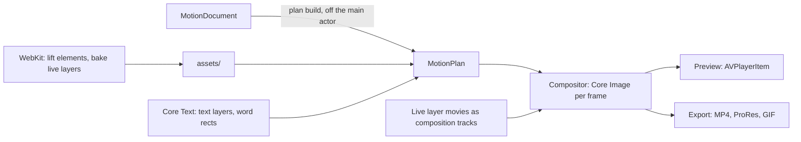

# Motion editor

> Launch videos as motion design, not recordings: scenes of layers (the product's real UI lifted
> from its live page, type, images, shapes) moved by a hand-designed motion grammar, rendered
> frame-exact by Reco's own renderer, editable on the timeline and by Claude. The bar is Linear's
> official launch videos, judged side by side.

## Why

Reco makes walkthroughs: it films one live page frame by frame and polishes it (zoom, cursor,
canvas, motion blur). Spec 0010 puts captions, cards and music over that. The launch videos people
admire are something else: motion design. Measured on official videos (2026-10-06; details in
[Measured references](#measured-references)):

| Video | Length | Beats, median | What it is |
|---|---|---|---|
| Linear, *Introducing Linear Agent* | 55 s | 14, 3.70 s | A dark UI plane tilted in 3D with a band of focus; each shot drifts at constant speed and 9 hard cuts hide every start and stop; typing; near-black; one closing line |
| Linear, *Linear for Agents* | 33 s | 16, 1.75 s | Flat UI crops, titles that sharpen from a blur, a word that rolls like a slot machine, UI states changing in place |
| Raycast, *New Raycast. Coming 2026* | 39 s | 29, 1.00 s | Real UI as glass panels over a rendered backdrop, macro typing close-ups, a monospace "NEW …" list swapped every 0.4 s |
| Framer, *That's Framer* | 38 s | 18, 1.60 s | The editor building a site, site cards stacking, a long pull-back, one 3D brand asset |
| Notion, *Introducing Notion 3.0: Agents* | 90 s | 37, 2.23 s | UI, the brand's illustrations, huge typed type ("Create a \|") |
| Freelancer promo for Raycast (After Effects) | 51 s | 37, 1.27 s | Rebuilt UI, red rim lights, light sweeps, orbiting icons: the "mid-level" look |
| Raycast *Focus* / Cursor 3 / Arc 1.0 | 34–90 s | 19–27 hard cuts | Live action or archive film: not reachable by code, not a goal |

The premium UI videos are calmer than the freelancer one, not flashier. Against them the
freelancer holds text 0.37 s instead of 2.0, types twice as fast, snaps moves out of cuts at full
speed, and colors 80% of the frame instead of about 4%. Their quality is a sharp UI with
believable data, one idea per shot, depth of field, and timing. That is reachable in code.
Inventing motion from a free prompt is not: language models add elements and effects at even
spacing, which is the template look.

Nobody combines what Reco already has (a frame-exact renderer of real pages, telemetry, a native
editor, Claude over MCP) into motion design. See [Competitors](#competitors).

## Expected outcome

- **Record with AI Agent…** in **Launch Video** mode takes a website address and an optional line
  ("we just shipped agents"). Five to fifteen minutes later the editor opens on a 30–45 s motion
  video of that product: its real UI lifted from the live page as sharp layers, type, a camera,
  transitions, music.
- Every scene, layer, move and keyframe is editable in the editor and by the chat. "Keep everything
  else; make this push slower, reveal the heading word by word, move the UI transition 8 frames
  earlier" changes those properties only, in one undo step, without capturing or rendering
  anything again.
- Same document, same pixels: preview and export share one renderer, as in the editor.
- **The bar:** a 10 s recreation of Linear Agent (two drifting shots and the cut between them),
  made with the grammar, that a person can't tell from the original at a glance on a phone; and
  three different products whose videos don't look alike.

## Non-goals

Live action, 3D models, illustration or generative imagery, voiceover (spec 0010, open question 2),
agent-written HTML, JSX or expressions, pen-drawn masks, particles, plug-ins, a web or Windows app,
Remotion or GSAP as dependencies. This is not After Effects: it is a small motion system for
software launch videos.

---

## Research

### Competitors

As of 2026-10-06. Repos read with `gh`; everything else from the vendors' pages unless marked.

| Tool | Real UI | Editing | Agent | Platform, price |
|---|---|---|---|---|
| **Hera / Hera Launch** (YC S25) | Screenshots as reference | Prompt, per-scene parameters | Own model; API and MCP | Web, ~$20–100/mo (unverified); #1 on Product Hunt 2026-04-30 |
| **Remocn Studio** (MIT, public 2026-10-01) | None | Chat; click an element to tune type or easing, written back to TSX. No timeline on purpose | User's Claude Code, Codex, Copilot, Grok | Mac (Tauri), free; Remotion projects; 146★ |
| **HyperFrames** (HeyGen, Apache-2.0) | `capture` saves screenshot, DOM, tokens; "use the real screenshot, rebuild only the component that moves" | Studio and Mac app with timeline, keyframes, easing; code stays the source | Any coding agent | Free; 57.8k★, ~2M npm/mo; HTML + GSAP in headless Chrome |
| **Remotion** | None | Studio 4.0.475: drag keyframes, easing editor, written back to code in its own pattern | Agent skills (577k installs) | Free under 4 people; apps that embed it pay $0.01/render, $100/mo minimum |
| **Frame24** | **DOM capture** via Playwright: real text and elements it can click, highlight, retype | Prompt only, three approval gates | MCP for Claude Code, Cursor, Codex | Web, $39–399/mo + $20/film |
| **EndFrame** | Reads the repo's design system and copy (how it renders UI: unverified) | Timeline, versions, a 33-rule quality gate | User's Claude, ChatGPT or Grok | macOS 15+, free early access (Show HN 2026-09-08) |
| **Cardboard** (YC W26) | Only footage you upload | Timeline keyframes, properties panel | User's Claude or ChatGPT | Mac, $8–175/mo |
| Jitter, Lottie Creator, Rive, Cavalry | Figma frames or none | Prompt → editable keyframes | Own / MCP (Cavalry) | Design tools, not launch videos |
| Arcade, Supademo, AIDemo, Demosmith, Tella, Screen Studio, Cap, Clueso | Screenshots or recorded pixels | Scene timelines, zooms | Some MCP | Recorders and demo builders |
| GitHub skills (brag 13.8k★, video-shotcraft 10.4k★, launch-video-clone, agentic-product-demo, videowright) | Screenshots, rebuilt UI, or the app's own source | Code | Any | Free |

Motion Canvas, Revideo and Theatre.js are dormant (last releases 2024–early 2025).

**Who animates real UI as layers?** Frame24 comes closest (a DOM capture it can act on) but is
cloud and prompt-only. videowright animates real components, but needs the app's source.
HyperFrames freezes a screenshot and rebuilds one component. Nobody lifts elements from any live
address, without source access, as layers that stay sharp at any zoom, inside a keyframe editor.

**The direct threats:** EndFrame (Mac, the user's own plan, timeline, quality gate, free), Frame24
(DOM capture), HyperFrames (reach, and a Mac app).

### What the best tools encode, and what backfired

- **Doctrine from measured films beats quotas.** Remocn's own audit (2026-09-09) found that its
  rules ("6–10 elements per frame", "2–5 decorations", "at least 2 focal points", mandatory
  secondary motion) caused what users kept deleting: huge background words, extra lines, constant
  scale drift. memex's skill demands "minimum 3 independent motion layers per scene". The rule
  sets drawn from real films agree on the opposite: a smooth long settle, stillness allowed,
  2–3 frame staggers, motion tied to an event, the camera moving only for a reason.
- **No bounce.** HyperFrames' launch skill: "Bouncy is the #1 instant turn-off"; `power3.out`
  default; no `back`, `bounce` or `elastic`; "I'd rather have NO motion than BAD motion".
- **Measure the references.** launch-video-clone measured Raycast's list cascade ("log-scale
  quartic ease-out over 30–33 f at 30 fps, no overshoot, rows 2–2.5 f apart") and grades renders
  against the reference's motion curve (correlation ≥ 0.95). Remocn measured 15 official films
  (Apple, Linear, Vercel, Raycast, Stripe; 449 intervals): median interval 1.33 s, middle half
  0.75–2.17 s, 68% cuts, 25% motion transitions, 5% fades, 56% of boundaries within 4 frames of a
  beat, picture moving 59% of the time.
- **UI rules** (agentic-product-demo): entrances from scale 0.9–0.97 and ≤ 16 px; staggers ≥ 2
  frames; counters count, typed text types; the pointer lands on what it presses, using
  coordinates from a rendered frame (estimates from CSS were 94 px off); never put a lasting
  transform on the container of the whole UI (it resamples every glyph).
- **Check the pixels.** Remocn's `design_check` renders 2–9 frames and measures contrast on the
  real pixels behind the glyphs (4.5:1, 3:1 at ≥ 24 px), flags clipped, covered or out-of-frame
  text, a frozen stretch (≥ 45 frames), scene lengths all within 15% of their mean, audio clipping
  and silences ≥ 0.3 s; a defect counts only after it lasts ≥ 0.5 s across ≥ 2 samples. The root
  cause of the generic look is that the agent never watches its own render (snapcn).
- **The tells of AI motion** (snapcn, HyperFrames, Remocn): a centred headline on a purple-to-blue
  gradient fading up 20 px; the same ease and 0.4–0.5 s on everything; the same stagger in every
  scene; an ambient zoom on every scene; motion starting at t = 0; everything entering at once;
  front-loading then freezing; gradient text; glows over 24 px; pure #000 or #fff; Inter, Roboto,
  Poppins as the face.

### Craft defaults

Sources are listed under [Sources](#sources). These are starting values for the grammar; phase 3
tunes them against the benchmark and records what changed.

| Parameter | Default | Source |
|---|---|---|
| Enter | cubic-bezier(0.33, 1, 0.68, 1) (out-cubic); fast: (0.16, 1, 0.3, 1) (out-expo) | easings.net, HyperFrames |
| Exit | (0.32, 0, 0.67, 0) (in-cubic), shorter than the entrance (0.25 vs 0.4 s) | easings.net, HyperFrames |
| Move on screen | (0.65, 0, 0.35, 1) (in-out-cubic) | easings.net |
| Spring | damping ratio 1, response 0.4 s; 0.85 only after a gesture with momentum; never < 0.55 | WWDC18, WWDC23 |
| UI move | 0.3–0.5 s; duration grows with distance | Material 3, HyperFrames |
| First move after a cut | 0.1–0.3 s | HyperFrames |
| Stagger | 0.08 s (2–3 frames at 30 fps), whole group ≤ 0.5 s | HyperFrames, launch-video-clone |
| Text hold | max(1.2 s, 0.6 s × words) | BBC (0.3 s/word), read twice at 200 wpm |
| Slowest / fastest scene | ≥ 3× | HyperFrames |
| Seam | cut at matching speed and direction; zoom-through 0.2 s out (1→1.2) + 0.5 s in (0.75→1, out-expo); blur at a cut ≤ 10 px on text, 18–20 px on surfaces | HyperFrames cut catalog |
| Zoom | scale in log space; pan-and-zoom on van Wijk's path (ρ = √2) | d3-interpolate |
| Motion blur | 180° shutter: 0.5 / fps | After Effects default |
| Safe area | graphics inside 90% of the frame | EBU R95 |
| Headline | ≥ 6% of frame height; body ≥ 32 px at 1080p | HyperFrames, BBC |
| Display tracking | SF Pro 0 at ≥ 80 pt; Inter −0.022 em | Apple HIG, rsms |
| Contrast | 4.5:1, 3:1 at ≥ 24 px | WCAG via Remocn |
| Hit vs beat | on the beat to 3 frames early, never > 1 frame late | ITU-R BT.1359 |

Measured values in the next section replace these where they disagree.

### Measured references

Measured with ffmpeg and numpy on the five official videos above and checked against extracted
frames. A beat is a cut, a soft transition over half the frame, a new UI state or a new title line.

| Constant | Min | Median | Max | Freelancer |
|---|---|---|---|---|
| Beat length | 1.00 s | 1.75 s | 3.70 s | 1.27 s |
| Shot, cut to cut | 1.30 s | 2.70 s | 5.32 s | 2.53 s |
| Title hold (8 titles) | 0.90 s | 2.0 s | 2.5 s | 0.37 s |
| Words per second while held | 1.5 | 3.1 | 8.7 | 8 |
| Title blur-in | 0.50 s | — | 0.63 s | none |
| Settle after a title cuts on | 0.17 s | 0.2 s | 0.25 s | 0.13 s |
| Typing | 7.5 cps | 15 cps | 25 cps | 27 cps |
| Eased move, visible part (17 moves) | 0.23 s | 0.50 s | 2.03 s | 0.37 s |
| Move shape | peak speed at 43% of the move, 65% of the distance by mid-time: cubic-bezier(0.5, 0, 0.2, 1), set ~0.7 s for 0.5 s visible | | | eases out from full speed, 78% by mid-time |
| Peak pan speed | 13 %W/s | 57 %W/s | 113 %W/s | 40–117 %W/s |
| End card | 1.87 s | 3.6 s | 4.45 s | 1.47 s |
| Headline cap height | 2.8% of H | 6.7% | 8.9% | 5.5–13.2% |
| Mean luma (dark videos) | 12.7 | 18.9 | 23.7 | 54 |
| Colored pixels | 0.4% | 4.3% | 21% | 80% |
| Tempo | 120 BPM | 144 | 156 | 118 |

- **Linear's camera never eases.** Each shot drifts at constant velocity (pan 0.4–3.5 %W/s,
  median ~2; zoom −5.7 to +0.8 %/s, steady within 1–10%) and hard cuts hide every start and stop.
  All eased motion is in the UI (a 0.82 s chat scroll, a 0.23 s ease-out on send). Depth of field
  is a graduated band across the tilted plane: 4–24% of the frame sharp. Mean luma 12.7; 0.4% of
  pixels colored.
- **Titles:** Linear blurs a word in over 0.63 s, then wipes the rest in left to right with a blur
  (~44 ms per character) while the first word slides and shrinks to 0.9× (0.92 s). Linear for
  Agents rolls the last word ("Agents for Coding / DevOps / Triage / Planning", 0.1–0.23 s a roll,
  every ~0.5 s). Notion cuts titles on and lets them settle in 0.17–0.25 s, a second line
  0.83–1.0 s later.
- **Long settle:** Framer's pull-back starts at full speed on a cut and eases out exponentially
  (time constant ~0.9 s: half done at 0.65 s, 90% at 2.55 s, −30% scale over 4.5 s).
- **End cards** are static: the logo 1.9–4.5 s, Linear for Agents then a 0.93 s linear fade and
  0.67 s of black.
- **Beat sync isn't evident.** Cuts land near audio onsets no more often than chance (Linear for
  Agents 30% against 33%); Linear Agent and Raycast have no clear pulse. Remocn reports 56% of
  boundaries within 4 frames of a beat across its 15 films; with ~4 onsets a second, chance alone
  gives 15–36%.
- **Not measured:** motion blur amount, color grading, sound effects.

So the grammar has two pacing modes: **drift and cut** (Linear: 3–5 s shots, a camera at constant
speed, hard cuts, eased motion only inside the UI) and **beats** (Raycast, Framer, Notion: 1–2 s
beats, eased camera moves, long settles).

### Rendering spike

Measured on an M5 (Mac17,3), macOS 26.5.2, `-O`, load average 3.8–9.2, with a throwaway harness
that set WebKit up as `OffscreenWebWindow` does (not kept; phase 0 rebuilds what it needs).

**WebKit snapshots** (`WKWebView.takeSnapshot`, painted on the CPU in `com.apple.WebKit.GPU`, ~3
cores while snapshotting):

| Feature | Result |
|---|---|
| Layout, type (system-ui 160 px, weights 100–900), crisp at 2× | Works |
| 2D transforms, opacity, `clip-path`, `mask-image`, gradients, `background-clip: text` | Works |
| `filter: blur()` / `drop-shadow`, `mix-blend-mode`, box- and text-shadow | Works |
| WebGL and 2D canvas | Works |
| CSS and Web Animations paused and seeked | Exact (positions at 250–1750 ms exact; opacity within 1/255) |
| **CSS 3D** (`perspective`, `rotateX/Y`, `preserve-3d`) | **Flattened**: no foreshortening, planes painted in DOM order |
| **`backdrop-filter`** | **Missing**: only the fill is drawn |
| Transparency | Only with the private `drawsBackground = false` (KVC); opaque white otherwise |

Snapshot time at a 1920×1080 viewport: a simple scene 0.9 ms at 1×, 2.9 ms at 2×; a Linear-style
scene (tilted card, 60 px glow blur, blurred far copy, word blur reveal) 120 ms at 1×, **572 ms at
2×**, of which the 60 px blur alone was ~370 ms. Without blurs and 3D: 63 ms.

**Core Image** on Metal, 3840×2160, color management off, `cacheIntermediates: false`, wall p50 /
p95 ms: copy 1.4 / 2.1; `CIPerspectiveTransform` 1.2 / 1.9; `CIGaussianBlur` r20 4.5 / 7.2;
`CIBloom` 4.8 / 6.0; `CIMaskedVariableBlur` r20 (tilt-shift depth of field) 6.6 / 8.0; 5 layers
source-over 3.1 / 4.4; perspective + masked blur 9.1 / 13.8; a whole Linear-style frame
(background, glow, tilted card with depth of field, text, bloom) 11.1 / 17.1. The tilted card
with depth of field already reads like the Linear Agent shot.

**So:** WebKit draws flat layers (it is exact and crisp); Core Image moves them (3D, depth of
field, large blurs, glow, compositing). A 4K frame with everything on is over the 8 ms budget,
so the preview renders at its display size and exports run offline.

### What makes Reco better

1. **Live UI as layers from any address.** Lifted from the page Reco already renders frame-exact,
   sharp at any zoom (captured at the scale it is shown), with real hover, typing and state
   changes, and exact telemetry for where the cursor lands. Competitors freeze, rebuild, record or
   need the source.
2. **A document both people and Claude edit as data.** Not code (Remocn, HyperFrames, Remotion),
   not prompts only (Frame24, Hera). The agent edits properties through validated operations;
   every edit is an undo step; nothing is regenerated.
3. **Taste in the grammar, not the model.** Claude picks shots, writes copy, fills slots and
   times them; it never invents motion. The grammar is designed by hand from measured films, with
   no quotas.
4. **A critique loop on our own pixels.** Lint rules on the document, a design check on rendered
   frames, a contact sheet Claude looks at, and a comparison with the reference's curves.
5. **Native, local, free.** Swift, AVFoundation, Core Image; no Chrome, Node or render fees; the
   user's own Claude plan.

---

## Architecture

### Model

A motion video is a folder bundle next to the recordings: `<name>.motion/` holding
`document.json`, `assets/` (lifted UI images, baked live layers, the logo) and `cache/` (beat
analysis). Exports go next to the bundle. Unknown versions are refused, like `EditorProject`.

```
MotionDocument v1
  canvas    size, fps (60), background, pacing (driftAndCut | beats)
  style     StyleTokens: background, surface, text, dim, accent, face (sans | serif | mono), radius
  assets    [Asset]: id, kind (ui | liveUI | image | logo), source (url + selector + steps | bookmark)
  scenes    [Scene]: id, duration, shot (grammar id + slots + params), seamIn,
            layers [Layer], camera (move instances + keyframe overrides)
  audio     music (bookmark, offset, volume, fades), beats
Layer
  id, name, content (text | ui | liveUI | image | shape | group), z
  base      Transform3D (position, anchor, scale, rotation x/y/z, depth), opacity, blur, radius, shadow
  moves     [MoveInstance]: grammar move id + params (start, duration, intensity, stagger, direction)
  overrides [PropertyTrack]: keyframes (time, value, easing) a person or Claude set by hand
```

- **Moves are the source of truth, keyframes are overrides.** A property's value at a time is its
  base, then its moves expanded into keyframes when the plan is built, then any override track for
  that property. Changing a move's duration or swapping `text.fadeUp` for `text.blurWipe` is one
  property edit. Editing a keyframe by hand turns that property into an override, as editing an
  automatic zoom makes it manual today.
- **Shots are templates of layers, moves and a camera.** Claude picks a shot and fills its slots
  (text, a UI asset, a focus element); the shot lays them out by the layout rules. After that
  every layer and move is editable on its own.
- **Time** is seconds on the document's timeline (scene durations add up; no cuts, so no
  `TimeMap`). Values snap to the frame grid of `canvas.fps`; frame indices are compared, never
  doubles.
- **Space** is 2.5D: each layer is a plane with a depth; one camera with a focal length looks at
  them. Planes don't intersect (painter's order by depth), which the document validates.

### Grammar (the product's core)

Pure functions in `Motion/Grammar/`: `expand(move, params, layer, context) -> [PropertyTrack]`,
`layout(shot, slots, style, canvas) -> [Layer]`. Each is unit tested and has golden frames.

- **Easing set:** `enter`, `enterFast`, `exit`, `move` (the measured UI move, (0.5, 0, 0.2, 1)),
  `settle` (spring, ratio 1), `longSettle` (exponential, time constant ~0.9 s), `linear` (only
  drift, typing and counters). No bounce, back or elastic exists to choose.
- **Moves (v1, ~17):**
  - Text: `fadeUp`, `blurIn` (0.5–0.63 s), `blurWipe` (left to right with a blur, ~44 ms per
    character), `lineMask` (rise out of a mask), `type` (15 characters a second by default),
    `roll` (one word replaced in place, *Agents for DevOps → Planning*), `exit`.
  - UI: `rise` (0.95→1, ≤ 16 px), `tilt` (the plane leans back with perspective), `cascade` (rows
    2–2.5 f apart, log-scale out-quart), `focus` (frame one element; the rest dims or falls out of
    focus), `detach` (an element lifts off the plane, its shadow grows), `stateChange`.
  - Camera: `hold`, `push`, `pan` (van Wijk path), `pullBack` (starts at speed on a cut, long
    settle), `drift` (constant velocity, ~2% of the width a second and a slow zoom; its start and
    stop are hidden by cuts: every shot in drift-and-cut pacing, none in beats pacing).
  - Seams: `cut`, `cutOnMotion` (velocity matched), `zoomThrough`, `blurCut`, `push`, `fade`
    (rare).
- **Shots (v1, ~9):** `hook` (≤ 6 words over the dimmed product), `title` (type alone, scale
  contrast, left or centred by style), `uiHero` (tilted plane, drift, a band of focus), `uiFocus`
  (tight crop, typing or clicking), `uiCascade`, `featureSequence` (items one at a time, never all
  at once), `stat` (a number that counts), `recording` (an existing take in a frame), `endCard`
  (logo, address, call to action; static, ~3.6 s).
- **Rules, one place each** (used by shots, the lint and the MCP validation alike): reading time
  (title holds ≥ 0.9 s); type sizes and safe area; contrast; first move 0.1–0.3 s after a seam;
  at most two primary moves starting within 0.1 s outside a stagger group; stagger groups ≤ 0.5 s;
  exits shorter than entries; slowest scene ≥ 3× the fastest; typing ≤ 25 characters a second;
  no stretch over 1.5 s with nothing moving and nothing to read (except the end card); one accent,
  on at most ~5% of the frame's pixels. Snapping to beats is a choice per document, not a rule:
  the references don't show it.
- **Variety comes from the brand, not randomness:** face, palette, radius and pacing mode come
  from the page, so two products differ without a dice roll. Every choice is deterministic.

### Rendering



- **Drawn once per plan:** text layers through Core Text (SF Pro, New York, SF Mono, as spec 0010
  decided; web fonts are an open question) as one image plus word and line rects, so word reveals
  crop it per word; shapes; shadows; lifted UI images; the logo.
- **Lifted UI (`ui`):** the element's box snapshotted with `WKSnapshotConfiguration.rect` (the
  offscreen window resized to fit elements taller than the viewport) at the largest scale it is
  shown (layer scale × camera zoom × output pixels per CSS pixel, at most 8×), alone on a
  transparent page, so its own rounded corners are its alpha. Cached by a hash of (address,
  selector, viewport, steps), one file per scale.
- **Live UI (a `ui` asset with steps):** a web take of the page cropped to the element: the same frame-exact
  renderer, the same steps as `record_page` (hover, click, type, scroll), baked ahead into a movie
  in `assets/` with its telemetry. Each baked movie is a source track of the composition, so
  AVFoundation decodes and seeks it; the cursor is drawn from the telemetry in the layer's space,
  so it tilts with the plane (`CursorPath` reused).
- **Per frame (Core Image):** for each visible layer in depth order, sample its tracks (O(1),
  precomputed at 120 Hz like `CameraPath`), project its four corners through the camera (simd 4×4)
  into `CIPerspectiveTransform`, then opacity, blur, reveal mask; depth of field by depth per layer,
  and `CIMaskedVariableBlur` for a tilted plane; motion blur by sampling moving layers across a
  180° shutter at the output frame rate.
- **Composition without a recording:** today everything assumes a source movie (loader, plan size,
  composition, export, GIF, window key). Phase 0 decides between an empty video track
  (`insertEmptyTimeRange`) driving the compositor, and a generated placeholder movie, the pattern
  web takes already use.
- **Budget:** the preview renders at its display size (≤ 1080p) in < 8 ms p95; exports run
  offline and are measured (target: 1080p60 at least real time). Every phase measures with
  `OSSignposter`.

### Agent

Claude writes no motion code. It edits the document through validated operations and looks at
what it made.

| Tool | Does |
|---|---|
| `inspect_page` (extended) | Adds `brand` (colors, face, radius, logo box; spec 0010 step 3), liftable elements (cards, panels, app mockups ≥ 120×60 CSS px with their radius and background), fixed overlays to hide |
| `capture_ui` | Lifts an element (static), or bakes a live layer from steps; long-polls like `record_page` |
| `edit_motion` | Creates or edits a document with operations (add scene, set shot, fill slot, set text, set move parameter, set style, set music, move, remove); validated by the grammar's rules; returns a summary and lint warnings; no rendering |
| `preview_motion` | A contact sheet (a frame per beat, at most 12) as MCP image content, plus the design check's findings |
| `export_recording` | Accepts a motion bundle; adds `aspect` |

- An open window applies agent edits through its view model, each one an undo step named after
  the operation, so ⌘Z undoes Claude. The file is never edited behind an open window.
- **Launch playbook:** research the product (as spec 0009) → a pitch and a hook (≤ 6 words) →
  a shot list of 4–8 beats from the shot catalogue → lift and bake the UI → fill copy → time to
  the music → preview → fix (lint and design check must be clean; one vision pass on the contact
  sheet) → export. Doctrine, not quotas: the playbook says what good looks like and forbids the
  tells; it never asks for a number of elements.
- **Chat edits instead of re-recording.** A change to text, timing, style or music is an
  `edit_motion` turn; only new footage captures again. An edit-only turn counts as success
  (`AgentRunOutcome` today calls it "finished without recording"). The selected scene or layer is
  sent with the message, so "make this faster" has a target.

### Editor

Motion bundles open in the editor window: same stage, transport, side panel and chat; their own
lanes and inspector sections. New code lives in `Reco/Motion/`; `EditorViewModel` is at 498 of
500 lines, so motion gets its own view model, sharing the playback controller, export and chat.

- **Timeline:** a scenes lane (shot blocks, seam markers), a lane per layer (its visible range,
  move markers inside), the camera lane, the music lane (waveform, beat ticks). Built on
  `TimelineLane` and `TimelineClip`.
- **Stage:** click a layer to select it; drag to move, handles to scale (writes the base or a
  keyframe at the playhead).
- **Inspector:** Scene (shot, duration, seam), Layer (content, role, moves with their parameters),
  Style (brand tokens), Music. A keyframe curve editor comes last.

---

## Engineering standards

CLAUDE.md's quality bar and spec 0003's standards apply. In addition:

- The grammar is pure, `nonisolated`, `Sendable` and fully tested: every move, shot, rule and
  easing has unit tests; every shot has golden frames (rendered at 480 px, compared within a
  tolerance) so a change in feel is a visible diff.
- A rule lives in one function used by the shots, the lint and the MCP validation.
- Measured numbers go into comments with their conditions, like `shadowTopFraction`.
- No third-party dependencies.

## Phases

Each phase ends mergeable, measured and documented. The benchmark from phase 0 is re-run at the
end of every phase and its scores recorded here.

| Phase | Size | Status |
|---|---|---|
| 0 - Benchmark and spikes | M | Done but the side-by-side |
| 1 - Document, core, compositor | L | Done; the window not yet seen in the app |
| 2 - Real UI layers | L | Done; the window not yet seen in the app |
| 3 - Grammar v1 | L | Done but the side-by-side and the three-site judgement |
| 4 - Agent | L | Done but the side-by-side; cost recorded for one run of three |
| 5 - Music and beats | M | Todo |
| 6 - Editing | L | Todo |
| 7 - Formats and polish | M | Todo |

### Phase 0 - Benchmark and spikes (M)

- **Benchmark:** 10 s of Linear Agent (two shots and a cut) and the Linear for Agents opening
  (8 s) as targets; three sites for end-to-end runs (a dark serif one, a light sans one, a
  slow-to-paint one; spec 0010's cardboard.ai, linear.app and supabase.com unless better ones turn
  up); a rubric scored from frames and the run's log: the lint and design check clean, text
  readable on a phone, shot lengths and holds inside the measured ranges, no tells from the list
  above, time and cost per run, and a side-by-side look by the user.
- **Spike A, composition without a recording:** empty track vs placeholder movie, through preview,
  export and the GIF reader.
- **Spike B, lifting an element:** `rect` snapshots at 2–4× of cards on the three sites; the
  `border-radius` mask; transparency through `drawsBackground` against matting from a black and a
  white snapshot; cost per lift.
- **Spike C, the shot by hand:** a throwaway harness (Swift, outside the app target) that renders
  the 10 s Linear Agent recreation from lifted UI with Core Image: plane, camera drift, depth of
  field, typing. Compare frames side by side with the reference.

**Done when:** the user has looked at the side-by-side and judged it close enough to build on, or
named what's missing; spike A and B results are written here.

#### Phase 0 results (2026-10-06, M5, macOS 26.5.2)

**Rubric** (scored per run; a run passes with every check clean and the side-by-side accepted):

| Check | Pass |
|---|---|
| Lint and design check | No findings |
| Text on a phone (frame scaled to 390 pt wide) | Every line readable; headline cap height ≥ 2.8% of H |
| Pacing | Shots 1.3–5.3 s, title holds 0.9–2.5 s, typing ≤ 25 cps, end card 1.9–4.5 s |
| Tells | None of the list under *What the best tools encode* |
| Color | Dark videos: mean luma 12–24, colored pixels ≤ 21% |
| Run | Minutes and cost recorded |
| Look | The user's side-by-side verdict |

Targets: Linear Agent 0–10 s (two drifting shots and a cut), Linear for Agents 0–8 s. Sites:
cardboard.ai (dark serif), linear.app (dark sans, slow to paint), supabase.com (dark sans; a light
sans site is still to pick: all three are dark).

**Spike A, composition without a recording: a placeholder movie.** An `AVMutableComposition` whose
video track holds only `insertEmptyTimeRange` reports a duration of 0 and no video track:
`AVAssetReaderVideoCompositionOutput` asserts (`[videoTracks count] >= 1`) and nothing plays. A
1-frame 16×16 movie (written in 0.12 s) inserted once and stretched with `scaleTimeRange` to the
document's length works everywhere: frames through `AVAssetImageGenerator`, HEVC export (2 s at
320×180 in 85 ms, the compositor called for all 61 frames), GIF through the reader (50 frames at
25 fps) and `AVPlayerItem` (ready). The compositor ignores the placeholder's pixels.
In the test target, `AVAssetExportSession.export(to:as:)` crashed in its back-deployed thunk (as in
CLAUDE.md); through the app's `ExportService` it doesn't.

**Spike B, lifting an element.** `WKSnapshotConfiguration.rect` at 2× and 4× of the box from
`getBoundingClientRect`, after scrolling it into view:

| | Result |
|---|---|
| Cost | 2–35 ms at 2× (supabase.com's 1088×644 hero 35 ms), 10–93 ms at 4× (the hero at 4352×2574: 93 ms). The first snapshot after a load pays 55–164 ms |
| Sharpness | Text crisp at 2× (Linear's comment card) |
| Transparency | `drawsBackground = false` (KVC) plus a style that hides everything but the element (`body * { visibility: hidden }`, the element's subtree visible, `html, body` transparent) gives real alpha: Linear's card corners read alpha 0. No `border-radius` mask and no black-and-white matting (twice the snapshots) needed |
| Fails | cardboard.ai scrolls inside its own container, so `window.scrollTo` left its tiles outside the viewport and WebKit returned the whole view: lifting must scroll with `scrollIntoView` and check the rect. A card whose own background is transparent (supabase.com's second card) loses the page behind it: fill it with the nearest painted ancestor's background |

**Spike C, the shot by hand.** A standalone Swift harness (not kept) rendered the 10 s recreation from
three lifted linear.app pieces (the agent thread, the issue list with a diff, the composer): two
shots drifting at constant speed (pan 2 %W/s, push 1–1.5 %/s), each plane projected through a
camera (focal length 1.6 × H, `CIPerspectiveTransform`), a band of focus drawn in the plane's
space and projected with it into `CIMaskedVariableBlur`, a soft shadow under the near plane, a
hard cut at 4.8 s, and "create issues and assign to me" typed at 15 cps. 1080p60, `-O`: 7.5 ms
p50, 10.9 ms p95 a frame; 600 frames written in 6.2 s. Awaiting the user's side-by-side.

### Phase 1 - Document, core, compositor (L)

- `MotionDocument` v1, bundle and store; `PropertyTrack` sampling (cubic-bezier solver, spring),
  `Transform3D` and the camera projection; text (Core Text with word rects), image, shape and group
  layers; `MotionPlan` built off the main actor; the compositor; preview and export (MP4, ProRes,
  GIF) through spike A's composition.
- **Done when:** a hand-written document (a title, an image on a tilted plane, a push) previews and
  exports identically; golden frames pass; plan build, preview and export are measured.

#### Phase 1 results (2026-10-06)

What was built, and where it differs from the model above:

- **Keyframes only.** A layer's and a camera's animated properties are `keyframes`, keyed by
  property (`x`, `y`, `z`, `scale`, `rotationX/Y/Z`, `opacity`, `blur`; a camera only `x`, `y`,
  `z`). Moves, shots, `style`, `assets`, `audio` and `pacing` come with the phases that use them and
  are added to v1 as optional fields. An easing is coded as written: `"linear"`, `"hold"`,
  `[x1, y1, x2, y2]` or `{"spring": response}`; it shapes the way to the next keyframe, as in CSS.
- **Space:** canvas pixels, top-left origin, y down, z away from the camera; rotations as CSS's
  `rotateX() rotateY() rotateZ()`. The camera looks at `x, y` from 1.6 canvas heights in front of z 0
  (spike C's lens) and moves in by `z`; a layer at z 0 shows 1:1 from rest. Groups nest transforms
  and multiply opacity. Layers draw farthest first by their centre's depth, document order breaking ties.
- **Images** (text, pictures) are drawn once per plan at the largest scale they're shown, sampled at
  30 Hz over the scene, at most 4× the output; shapes are generated (`CIRoundedRectangleGenerator`).
  Shadows are blurred once in the layer's space and projected with it: blurring them per frame took
  most of a frame.
- **Composition:** spike A's placeholder movie (`MotionCompositionBuilder`), written once per launch
  into the temporary folder. Exports go through `ExportService` (HEVC, H.264, ProRes, GIF), as
  `<name>-edited` next to the bundle.
- **Window:** `open -a Reco <name>.motion` opens the preview with play, step and Export (HEVC,
  ProRes 4444, GIF). Editing comes in phase 6.

Measured on an M5, Debug, load average 1.8, with the demo document (`RecoTests/Fixtures/motion-demo.json`:
a title fading up, a tilted group of an image with a shadow and a shape, a camera push): plan build
10.7 ms; a frame at 1080p 0.6 / 0.9 ms p50 / p95 for the title and 1.7 / 2.5 ms for the plane (3.6 / 8.6
before shadows were drawn once); at 4K 4.6 / 7.1 ms. Export of the 5 s video at 1080p60 in HEVC took
1.26 s (4× real time), as a 540 px GIF 0.7 s. Golden frames at 480 px (four, `motion-demo-*.png`) and
the preview's composition match the renderer (mean difference under 0.5 of 255); the HEVC export's
frame is within a mean of 3.

### Phase 2 - Real UI layers (L)

- `capture_ui` as a service first (agent tool in phase 4): static lifts and baked live layers;
  live layers as composition tracks with their cursor; spec 0010 step 1 (the media clock, hiding
  overlays, signed-in pages) and step 3 (`brand`) land here.
- **Done when:** a card lifted from each benchmark site stays sharp at 3× zoom on a 4K export;
  a live layer types into a real field in sync with its cursor; lift and bake costs are recorded.

#### Phase 2 results (2026-10-06, M5, Debug)

- **Assets** (`document.assets`): an address, a selector and a viewport (1440×900 when left out).
  A `ui` layer (`{"ui": {"asset", "width"}}`) shows one at its own aspect ratio, a CSS pixel per
  canvas pixel unless `width` is given. Without `steps` it's a still; with `record_page`'s steps
  (and an optional `duration`) it's live. Captured into `assets/lifts` and `assets/live` when a
  plan first needs them, keyed by a hash of what decides the pixels, never written into the
  document. `UICapture.plan` builds, captures what the plan asks for, and builds again (at most
  twice: only a capture tells the plan an element's size).
- **Stills** are lifted at the scale the plan shows them, whole image pixels per CSS pixel up to 8×
  (4× the canvas on a 4K canvas, about two canvas pixels per CSS pixel); sharper lifts are kept,
  so a 4K export after a 1080p preview lifts once more. What the lift does, each measured:
  scrolls as little as it takes (linear.app fades its hero out as the page scrolls: centred it
  read opacity 0.09); waits for the finite animations on the element, its ancestors and inside it,
  up to 5 s (the hero fades in ~2 s after loading); hides the elements beside the path from the
  root rather than every element (under `body * { visibility: hidden }` WebKit left out
  supabase.com's code card's own background though it computed as visible); turns off
  `backdrop-filter`; grows the view for an element taller than it.
- **Live layers:** `inspect_page`'s look at the page, `record_page`'s timing and aiming, and a take
  rendered frame by frame of only the element's box where the page first shows it (the renderer's
  `crop`). Captured in two rounds: the box is measured first, then the take is rendered at the
  scale the plan shows it (whole, ≤ 8×, the movie ≤ 8,192 px): at a fixed 2×, DuckDuckGo's search
  shown at four times its CSS size on a 4K canvas read soft. The movie is a track of the
  composition, played from its scene's start, the last frame held when the scene is longer. Each
  frame is cut to the element's matte, its painted shape lifted without a fill (a corner radius
  left the square wrapper's grey around DuckDuckGo's pill), and gets the take's cursor drawn in the
  movie's space, so it turns with the plane; the shadow is cast by the matte too.
- **Done-when checks:** the three benchmark cards (linear.app's app frame, supabase.com's code
  card, cardboard.ai's dashboard) pushed 3× on a 4K canvas lifted at 7–8× and read sharp in 1:1
  crops of the export (cardboard.ai's embedded video is soft at its source). A live layer typed
  "launch videos from real UI" into duckduckgo.com's search field on a tilted plane, the I-beam on
  the field as each key landed; the local-page test checks the cursor is on the field when the keys
  are typed.

| Cost | Measured |
|---|---|
| Lift, still (page load and settle included) | supabase.com 2.7 s at 2× and 8×; cardboard.ai 6.2 / 6.5 s; linear.app 8.5 s at 2×, 30 s at 8× (10560×5760 px, 45 MB PNG): WebKit paints on the CPU |
| Three 4K lifts at 7–8× with their plan | 30.5 s, once; the 9 s 4K HEVC export then took 14.9 s |
| Bake, live | a 4 s take of a 400×200 panel 6.9 s; a 6 s take of duckduckgo.com's 694×48 search 10.6 s |
| Frame, 1080p, a live layer with a shadow | 1.1 ms p50, 3.1 ms p95 (load average 3.5); the 6 s export took 1.5 s |

- Two WebKit snapshots of 8× at once (two tests in parallel) made the GPU process quit
  ("An unknown error occurred"); one at a time they don't. Captures run one at a time per window.
- **Media on the take's clock** (spec 0010 step 1, in `WebClockScript`): once frozen, every
  `<video>`/`<audio>` the page plays is really paused and each frame seeks the ones in view to their
  time on the clock (looping, at their rate), waiting for `seeked` up to 5 s once; `play()`,
  `pause()`, `paused`, `timeupdate` and `ended` behave for the page as if it played, and
  `preload="none"` media is loaded first. A local 30 fps clip advances exactly half a frame per
  60 fps frame (`WebMediaClockTests`; with syncing off it froze). cardboard.ai's hero tiles pause
  themselves 2 s after landing on a desktop and play under the pointer: a take hovering the shoe
  tile shows its cuts 0.167, 0.283, 0.05, 0.117 s apart against the source's 0.166, 0.292, 0.042,
  0.125, at a constant offset (2.89–2.90 s), so frame for frame. One video seeking cost ~15 ms a
  frame at 1× (67 against 52 ms).
- **Clean page:** `inspect_page` lists `overlays` (fixed and sticky elements in view, outermost
  only: each benchmark site's header); `record_page` and motion assets take `hide`, a style
  injected at document start on every page, a rule per selector. The playbook says to hide what
  isn't the product, never the navigation.
- **Signed-in pages:** **Sign In…** in the agent bar opens the Web Recording window on its address
  (takes share its cookies); the playbook tells the agent the user may be signed in and to inspect
  the app (`/app`, `/dashboard`, where Log in leads) first. A take of `http://localhost` renders.
- **Brand** (spec 0010 step 3): `inspect_page`'s `brand` gives the background behind the first
  screen, the main heading's color, the accent (the largest painted link or button on the first
  screen), serif, sans or mono with the font's name, and the logo in the home link. linear.app:
  `#08090a`, Inter, accent `#e5e5e6`, no logo (its logo link isn't `/`); supabase.com `#131413`,
  Manrope, `#006338`, logo; cardboard.ai `#111315`, Denton serif, `#ffffff`, logo.
- Spec 0010 step 1's page changes (a cross-fade when a click opens a page) and step 3's browser
  frame aren't part of this phase.

### Phase 3 - Grammar v1 (L)

- The easing set, moves, seams, shots, layout rules and lint, each with tests and golden frames.
  The scenes lane and the Scene and Layer inspector sections, enough to tune parameters by hand.
- Tune against the benchmark: the phase 0 recreation is rebuilt from a document that uses only
  grammar shots; every default that changes is recorded with why.
- **Done when:** that document is under ~40 lines and passes the side-by-side; the same shot list
  on the three sites gives three videos that don't read as one template.

#### Phase 3 results (2026-10-07, M5, Debug)

What was built, and where it differs from the model above:

- **Moves add to the base; keyframes override.** A move expands (`MoveExpansion`, the one place
  its timing, distance and easing live) into tracks that multiply the base (`scale`, `opacity`,
  `shadow`) or add to it (everything else), so moves stack: a drift and a seam's zoom on one
  camera. A property with keyframes takes them and ignores its moves. New properties: a layer's
  `shadow` (strength; cast farther as it grows) and `dim` (outside a focus's region); a camera's
  `scale` (the lens: perspective kept), `blur` (the whole frame), `focus` and `aperture` (depth of
  field: blur per 100 px of depth off the sharp z, linear across a tilted plane, drawn with
  `CIMaskedVariableBlur` from two gradients projected with the plane).
- **Text reveals** aren't keyframes: `TextReveal` (type, wipe, rise) shows a text layer's
  characters or lines from `start + index × stagger`, cropped from the one image Core Text drew.
- **Shots are laid out when the plan is built** (`DocumentExpansion`), so a document names them in a
  line each; the scene's own layers go over them and one with a shot layer's id replaces it. The
  editor edits a shot's layer by writing such a copy. `roll` and `cascade` become other layers'
  moves there too (a roll is the line before its last word and a group per word).
- **Seams** (`SeamExpansion`) are camera tracks on both scenes; `push` and `fade` draw the scene
  before past its end for 0.5 s (a live layer's track is extended to cover it).
- **Moves (18):** text `fadeUp`, `blurIn`, `blurWipe`, `lineMask`, `type`, `roll`, `exit`; UI
  `rise`, `tilt`, `focus`, `detach`, `stateChange`, `cascade`; camera `hold`, `push`, `pan` (van
  Wijk's path, ρ = √2, `intensity` the zoom it ends at), `pullBack`, `drift`. **Seams (6)** as
  above. **Shots (7):** `hook`, `title` (its items' text roll the headline's last word), `uiHero`,
  `uiFocus`, `uiCascade`, `featureSequence`, `endCard`. `stat` (a counter needs per-frame type) and
  `recording` (an existing take as a layer, phase 7) are left for later.
- **Variety from the brand:** a sans headline wipes in blurred, a serif rises line by line, a mono
  is typed; serif headlines are regular weight, sans semibold; `style.alignment` places titles; in
  drift-and-cut every shot but the end card drifts, alternating direction scene to scene; in beats
  the camera eases instead (a push, a pull-back, a pan to the focus).
- **Rules** (`LayoutRules`, `ReadingTime`, `MotionLint`): reading time (held at least
  max(0.9 s, words ÷ 3.1)), 32 px text at 1080p, the 90% safe area, WCAG contrast on the
  background, first move 0.1–0.3 s after the seam, at most two starts within 0.1 s (a group's
  layers count once), exits shorter than entrances, the slowest scene 3× the fastest (from four
  scenes), typing ≤ 25 cps, no stretch over 1.5 s with nothing moving or to read (but the end
  card), hooks ≤ 6 words. The accent's share of pixels needs the design check (phase 4).
- **Editor:** a scenes lane (click to select and seek) and an inspector with Scene (shot, its text,
  duration, seam), Layer (each move's start, duration and intensity, the grammar's defaults shown,
  add and remove) and Rules (the lint's findings). Every change is an undo step (coalesced within
  a second), previewed after 0.15 s and saved after 1 s.

Defaults changed while tuning, and why:

- `uiFocus` in drift-and-cut leans as spike C's composer did (12°, −10°, −4°) and its focus also
  blurs what it dims (10 px at full dim): flat and only dimmed, it read nothing like Linear Agent's
  second shot.
- An end card without a logo sets the name at a headline's size: at 7% of the height it read weak.
- `blurWipe` blurs a character by 8% of its line's height as it fades in: 9.8 px for a 1080p
  headline, within the 10 px rule for text (12% gave 15).

Benchmark: Linear Agent's two shots and its title as `uiHero`, `uiFocus` (the agent panel's region)
and `endCard`, 10 lines of JSON; Linear for Agents' opening as a `title` rolling DevOps, Triage and
Planning over a `uiHero`, 10 lines. The same five-shot list (hook, uiHero, uiFocus, title, end card)
with each site's brand (linear.app sans drift-and-cut, supabase.com sans centred, cardboard.ai serif
in beats) gives three videos; lint finds only a short tagline hold and, by design, scene lengths
under 3× apart. Awaiting the user's side-by-side and verdict.

Costs: a plan builds in 0.09–0.26 s for these documents (with the Core Text layout of every shot);
a 1080p preview frame takes 0.4–5.3 ms p50 and 0.6–6.6 ms p95 (load average 2.7), except
cardboard.ai's `uiHero` and `uiFocus` in beats pacing, 8.3 and 8.7 ms p95: the camera zooms there,
so a large lift is projected and its depth of field drawn each frame. Blurring a lifted page for a
focus took the Linear focus shot to 9.4 ms p95; drawn once per plan (as shadows are) it takes 4.6.
1080p60 HEVC exports of the 14–17 s videos took 2.3–5.7 s (with the UI already lifted).

### Phase 4 - Agent (L)

- `inspect_page` extensions, `capture_ui`, `edit_motion`, `preview_motion` (image content: the
  tool's result type changes from text only), `export_recording` for bundles; the launch playbook;
  **Launch Video** mode in the agent bar (spec 0010); chat edits with selection; the outcome rules.
- **Done when:** the three sites go from address to finished video through
  `reco://record-agent` with clean lint and design check; rubric scores, minutes and cost per run
  are recorded; three chat edits ("slower", "word by word", "8 frames earlier") change only their
  targets.

#### Phase 4 results (2026-10-07, M5, Debug, Claude Code with Opus 5.5)

What was built, and where it differs from the model above:

- **Tools.** `edit_motion` (a batch of operations, all or none, then validated; no operations only
  describes the video: each scene's start, layers with their ids, a shot's own too, every move's start
  and end, and the lint's findings), `capture_ui`, `preview_motion` (a contact sheet as JPEG image
  content: one moment per scene once its entrances are in, at most 12, 3 columns at 270 px; 0.4–0.6 s
  for the grammar fixture, 89 KB) with the **design check** (a flat frame: luma deviation under 0.02;
  the accent over 5% of the pixels), `export_recording` taking a bundle (up to twice the canvas: 4K
  from 1080p, drawn at that size). `inspect_page` adds `liftable`: painted rounded boxes and pictures
  of at least 120×60, narrower than the page, largest first, at most 30. Long tools follow the
  45 s long-poll; a motion job is keyed by tool and bundle.
- **Operations:** `set_canvas`, `set_style` (hex colors), `set_asset`, `add_scene`, `set_scene`,
  `set_layer`, `set_moves` (a layer or the camera; a shot's layer keeps its layout: its moves go in
  the scene's `shotMoves`), `move_scene`, `remove`. Text on a shot that doesn't show it (`uiFocus`,
  `uiHero`) is refused instead of dropped.
- **Launch Video mode** in the agent bar (`reco://record-agent?mode=launch`), with a 20 min limit and
  the launch playbook (research, script, style from the brand, UI from `liftable`, at most three
  previews, export h264 at 2160). A run that edited a motion video is a success (`.edited`).
- **Chat** in the motion window (Style | Agent): the selected scene and layer go with the message
  ("this" means them); the change playbook describes first, slows by about 1.5×, previews once and
  doesn't export. The conversation is the bundle's `chat.json`.
- **Grammar additions from the runs:** `wordByWord` and `slideIn` moves, a sideways `exit`; drift
  capped at 4% of the width with its zoom slowed to match (a 10 s scene drifted captions off frame);
  `featureSequence` redesigned (an index, its line word by word, the UI turned towards it, sliding in
  and out, exits 0.1 s apart so no more than two leave at once); display type tracked −1.2%; a lift
  hides decorative `backdrop-filter` layers (linear.app's progressive blur drew streaks); a focus's
  edge is feathered; a rolled title's prefix stays where the centred line puts it (it sat at the
  box's left edge, leaving a gap before the rolling word on supabase.com).
- `AgentProcess` reads its pipes with `read(2)`: `availableData` raised an exception after a drain had
  left the pipe non-blocking, and that crashed the app.

Runs from the address alone (no instructions), 1080p60 documents exported as 4K h264:

| Site | Minutes | Cost (API-equivalent) | Video | Lint, design check | Pacing | Color (mean luma) |
|---|---|---|---|---|---|---|
| supabase.com | 2.7 | not recorded | 29.5 s, 6 scenes | Clean | Pass | 23 |
| cardboard.ai | 3.4 | not recorded | 29.1 s, 6 scenes | Clean | Pass | 32 (bright sky in its UI) |
| linear.app | 2.7 | $1.07, 13 turns | 34 s, 8 scenes | Clean | Hero 7.5 s (> 5.3) | 16 |

Lint and design check are of the finished bundles on the final build: supabase.com's run was made
before the rolled-title fix and cardboard.ai's before the staggered exits (both agents reported the
flaw and left it, as the playbook says). Agent runs don't keep a session (`--no-session-persistence`)
and print text, so cost is only known for the linear.app run, made by hand with the app's exact
arguments and `--output-format json`. The cost is Claude Code's `total_cost_usd`, tokens at API prices: a run uses the user's own agent and login, so on a subscription it counts against their plan's limits and nothing is billed to Reco or to them. The side-by-side verdict is the user's.

Chat edits on linear.app's video (`Linear 2.motion`), each through the window's message box with a
selection, each diffed against the document before it:

| Message | Selection | Seconds | What changed |
|---|---|---|---|
| slower | scene `features` | 75 | That scene's duration 10 → 15 s; nothing else |
| word by word | `hook.text` | ~30 | `shotMoves["hook.text"]` = `wordByWord` at 0.2 s; nothing else |
| 8 frames earlier | `agentTitle.detail` | ~40 | Its `fadeUp` 1.1 → 0.967 s (8 frames at 60 fps); nothing else |

### Phase 5 - Music and beats (M)

- A music track (spec 0010 open question 1 decides the source), onset detection on device (spectral
  flux on a log-mel spectrogram, peak picking; vDSP), beat tracking (autocorrelation with a
  120 BPM prior, dynamic programming), fades. Snapping seams and hits to beats is an option per
  document: the reference videos don't show beat sync, so it is judged by eye before it becomes a
  default.
- **Done when:** on three tracks, detected beats are within 1 frame of hand-marked ones for 90%;
  with snapping on, hits land on the beat to 3 frames early.

### Phase 6 - Editing (L)

- Layer and camera lanes, selection and handles on the stage, keyframe overrides, undo per agent
  operation, all inspector sections.
- **Done when:** everything the agent can change, a person can change by hand (a checked list).

### Phase 7 - Formats and polish (M)

- 1:1 and 9:16 by running layout again per aspect (not scaling), the keyframe curve editor, saved
  styles, an existing recording as a layer.

## Relation to spec 0010

| Spec 0010 | Here |
|---|---|
| Step 1: footage that looks right (media clock, hiding overlays, sign-in, page transitions) | Still needed; done in phase 2 |
| Step 2: text lane, cards, music | Replaced: text is a layer, cards are shots, music is phase 5 |
| Step 3: brand, browser frame | Phase 2 (`brand`), a shot style later |
| Step 4: `edit_recording`, `preview_recording`, playbook | Phase 4 (`edit_motion`, `preview_motion`) |
| Step 5: formats | Phase 7 |

The Walkthrough mode stays as it is.

## Proposed files

`Reco/Motion/`:

| Folder | Files |
|---|---|
| `Model/` | `MotionDocument`, `MotionScene`, `MotionLayer`, `LayerContent`, `Transform3D`, `PropertyTrack`, `Keyframe`, `Easing` (bezier solver), `MoveInstance`, `StyleTokens`, `MotionAsset` |
| `Grammar/` | `Move` and one file per move family, `Shot` and one file per shot, `Seam`, `LayoutRules`, `ReadingTime`, `MotionLint` |
| `Render/` | `MotionPlan`, `MotionFrameRenderer`, `LayerImages` (Core Text, shapes, shadows), `CameraProjection`, `DepthOfField`, `MotionCompositionBuilder` |
| `Service/` | `MotionStore`, `UICapture` (lifts and live bakes on `WebPageRenderer`), `DesignCheck`, `ContactSheet`, `BeatDetector` |
| `ViewModel/` | `MotionEditorViewModel` and its extensions (scenes, layers, agent edits) |
| `View/` | Scene, layer, camera and music lanes; inspector sections; stage handles |

`AgentBridge/Model/`: `CaptureUIRequest`, `EditMotionRequest` (operations), `PreviewMotionRequest`.
`AgentRecording/Model/AgentRecordingRequest`: `launchPlaybook`.

## Risks

- **Taste is the product.** The grammar has to be designed and tuned by eye against the
  references; the benchmark and the user's side-by-side gate every phase.
- **Samey output.** Variety must come from the brand and the shot choice; phase 3 checks three
  products side by side.
- **WebKit cost.** Pages snapshot in 14–310 ms (spec 0005); live layers are baked ahead with
  progress, and lifts are cropped to the element.
- **Transparency** relies on a private call or doubles the snapshot cost (spike B).
- **Signed-in products.** The real app is often behind a login: Sign In (spec 0010), localhost,
  or the user's recording as a layer.
- **4K cost.** A full Linear-style 4K frame measured 11 / 17 ms: the preview renders smaller, and
  one tilted depth-of-field plane per frame is the limit.
- **Scope.** The non-goals hold; anything new goes through the benchmark first.

## Open questions

1. Composition without a recording: empty track or placeholder movie (spike A).
2. Transparency: `drawsBackground` or black-and-white matting (spike B).
3. The page's own web fonts for type (licence, loading) or system faces only.
4. Music source (spec 0010, open question 1).
5. The editor's motion blur shutter is 1/48 s at its 50% default (`RenderPlan.maximumShutter =
   1/24`): 180° at 24 fps, 450° at 60 fps. Motion documents use 180° at the output rate; should
   recordings follow?
6. An agent-written HTML layer (HyperFrames-style) as an escape hatch for what the grammar can't
   do, or never.
7. Does Launch Video mode produce only motion documents, or also spec 0010's captioned take?

## Sources

- Competitors: hera.video, docs.hera.video/llms.txt, hunted.space/product/hera-6;
  github.com/Remocn/remocn-studio (README, `agent/skills/motion-design/rules/*.md`,
  `docs/analysis/generation-quality-2026-09-09`, `openspec/specs/agent/design-check/spec.md`);
  github.com/heygen-com/hyperframes (`skills/product-launch-video/references/motion-language.md`,
  `cut-catalog.md`, `skills/hyperframes-creative/references/*.md`, `docs/concepts/determinism.mdx`);
  remotion.pro/license, remotion.dev/docs/studio/interactivity, github.com/remotion-dev/skills;
  frame24.app/mcp; endframe.ai; cardboard.ai/changelog; jitter.video/changelog;
  github.com/per-simmons/launch-video-clone, github.com/Alexwtlf/agentic-product-demo,
  github.com/scosman/videowright, github.com/memex-lab/product-launch-video-skill;
  snapcn.dev/why-ai-motion-graphics-look-the-same.
- Craft: easings.net; material-web motion tokens; developer.apple.com/documentation/swiftui/animation,
  WWDC23 10158, WWDC18 803; bbc.co.uk/accessibility/forproducts/guides/subtitles; Netflix timed text
  style guide; tech.ebu.ch/publications/r095; d.rsms.me/inter-website/v3/dynmetrics;
  developer.apple.com/design/human-interface-guidelines/typography;
  linear.app/now/how-we-redesigned-the-linear-ui; vercel.com/design.md; provideocoalition.com/motion_blur; github.com/d3/d3-interpolate (zoom.js);
  librosa onset_detect; Ellis 2007 beat tracking; ITU-R BT.1359 via tvtechnology.com;
  arxiv.org/abs/2510.01174 (Code2Video), arxiv.org/abs/2605.16223.
- References: youtu.be/mRql2VJ99gM, youtu.be/sbwOQV5zY34, youtu.be/Mi173xGb0ZA,
  youtu.be/8AHPXm9Y6mI, youtu.be/R1cF4T4lgI4, youtu.be/ykaj0pS4A1A, youtu.be/UxbULt_hCdA,
  youtu.be/n5Vwrj1gEWs, youtu.be/czz9Tbf8VaE (freelancer).
